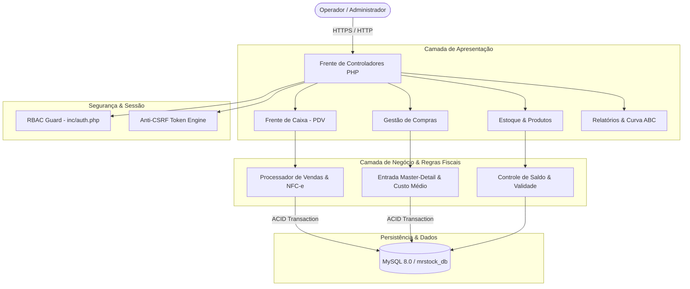
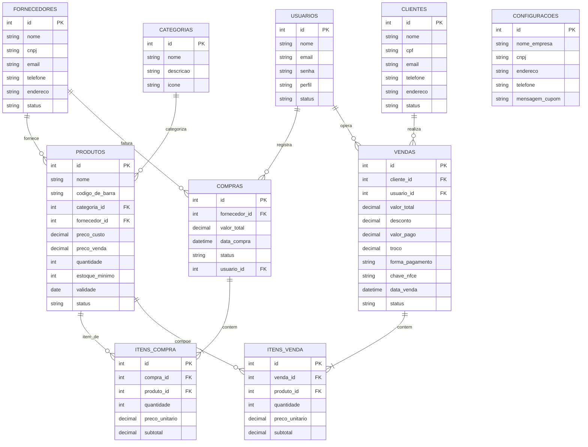
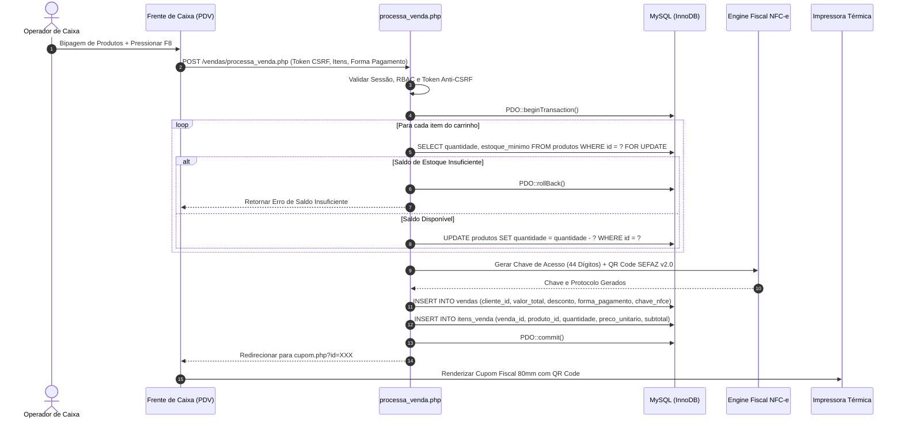
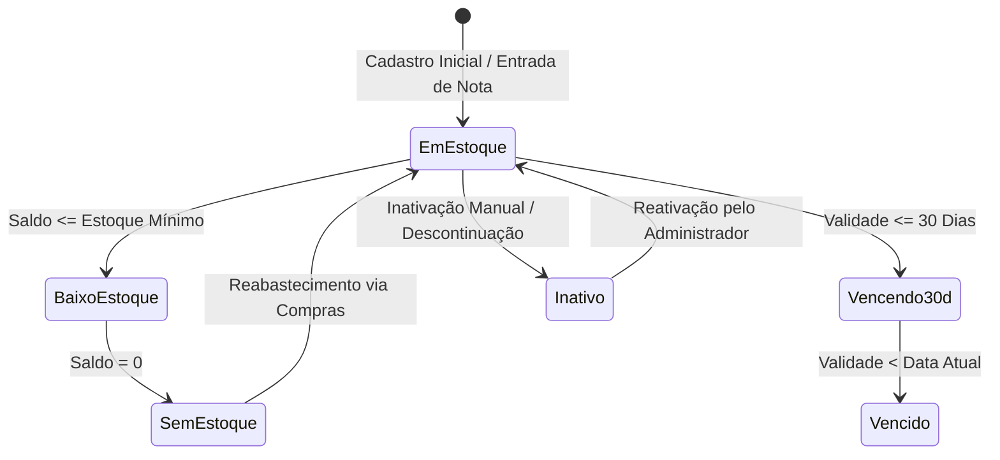

<div align="center">

  

  # MrStock ERP v2.0
  
  <p align="center">
    <strong>Plataforma Integrada de Gestão Empresarial, Controle de Estoque e Frente de Caixa (PDV)</strong>
    <br />
    <em>Engenharia de software aplicada ao comércio varejista físico com transações ACID, simulação fiscal de NFC-e e governança de dados.</em>
  </p>

  <!-- STACK TECNOLÓGICA -->
  <p align="center">
    <a href="https://www.php.net/releases/8.2/en.php"></a>
    <a href="https://www.mysql.com/"></a>
    <a href="https://getbootstrap.com/"></a>
    <a href="https://www.chartjs.org/"></a>
    <a href="https://fontawesome.com/"></a>
  </p>

  <!-- GOVERNANÇA & SEGURANÇA -->
  <p align="center">
    <a href="#seguranca-e-integridade"></a>
    <a href="#controle-de-acesso-rbac"></a>
    <a href="#frente-de-caixa-pdv"></a>
    <a href="LICENSE"></a>
    <a href="#roadmap-de-evolucao"></a>
  </p>

  <!-- SUMÁRIO EXECUTIVO DE NAVEGAÇÃO -->
  <p align="center">
    <a href="#visao-geral">Visão Geral</a> •
    <a href="#pilares-de-engenharia">Pilares Técnicos</a> •
    <a href="#arquitetura-do-sistema">Arquitetura</a> •
    <a href="#modelagem-de-dados">Modelo de Dados (DER)</a> •
    <a href="#fluxos-de-processamento-acid">Fluxos Transacionais</a> •
    <a href="#modulos-do-sistema">Módulos</a> •
    <a href="#controle-de-acesso-rbac">Matriz RBAC</a> •
    <a href="#seguranca-e-integridade">Segurança</a> •
    <a href="#instalacao-e-execucao">Instalação</a> •
    <a href="#equipe-e-creditos">Equipe & Orientadores</a>
  </p>
</div>

---

## <a id="visao-geral"></a>Visão Geral & Estudo de Caso

O **MrStock ERP** é uma plataforma de gestão empresarial e frente de caixa voltada para o varejo de pequeno e médio porte. O projeto foi concebido e modelado com base nas necessidades operacionais da **Papelaria Real**, um estabelecimento comercial com alto volume de itens cadastrados, fracionamento de mercadorias e demanda sazonal concentrada.

```
┌──────────────────────────────────────────────────────────────────────────────────────────┐
│                                   PAPELARIA REAL                                         │
├──────────────────────────────────────────────────────────────────────────────────────────┤
│  • Mais de 1.000 SKUs ativos divididos em 10 Famílias Funcionais de Produtos             │
│  • Picos sazonais de atendimento (Volta às Aulas) exigindo PDV com resposta instantânea  │
│  • Risco de perdas financeiras em itens perecíveis (colas, tintas, corretores, borrachas)│
│  • Necessidade de emissão ágil de NFC-e e impressão térmica padronizada                  │
└──────────────────────────────────────────────────────────────────────────────────────────┘
```

### Principais Dores Solucionadas
1. **Tempo de Atendimento no Caixa:** Redução do tempo de fila no PDV através de leitura contínua de código de barras, atalhos de teclado (F1 a F9) e cálculo dinâmico de troco.
2. **Prevenção de Ruptura de Estoque:** Controle paramétrico de estoque mínimo com alertas visuais e filtros de busca em tempo real.
3. **Gestão de Validade de Perecíveis:** Monitoramento ativo que sinaliza automaticamente produtos com vencimento em até 30 dias.
4. **Governança e Sigilo Comercial:** Operador de caixa executa vendas com integridade sem ter acesso a preços de custo ou margens de lucro bruto.

---

## <a id="pilares-de-engenharia"></a>Pilares de Engenharia de Software

```
   ┌───────────────────────┐   ┌───────────────────────┐   ┌───────────────────────┐
   │    TRANSAÇÕES ACID    │   │  DESIGN SYSTEM SÓLIDO │   │     GOVERNANÇA RBAC   │
   │  Isolamento InnoDB no │   │  Tipografia Tabular   │   │  Segregação estrita   │
   │  checkout e entradas  │   │  com botões sólidos   │   │  de perfis comerciais │
   └───────────────────────┘   └───────────────────────┘   └───────────────────────┘
```

* **Transações Atômicas (ACID):** Toda operação de compra, venda ou cancelamento utiliza `PDO::beginTransaction()`, `commit()` e `rollBack()`. Caso ocorra qualquer inconsistência de saldo ou interrupção de rede, os registros e saldos são revertidos instantaneamente.
* **Tipografia Numérica Tabular (`tnum`):** Todos os valores monetários (R$), quantidades, códigos de barras, IDs e datas utilizam `font-variant-numeric: tabular-nums`, assegurando alinhamento vertical e legibilidade de balcão.
* **Design System Sólido:** Interface desenvolvida com cores de fábrica preenchidas e contraste em conformidade com as diretrizes de acessibilidade WCAG 2.1 AA.

---

## <a id="arquitetura-do-sistema"></a>Arquitetura do Sistema

O sistema adota uma arquitetura em camadas com separação clara de responsabilidades desenvolvida em **PHP 8.2 Nativo / PDO / MySQL 8.0**:



---

## <a id="modelagem-de-dados"></a>Modelagem de Dados (Diagrama Entidade-Relacionamento)

A base de dados `mrstock_db` foi modelada segundo a 3ª Forma Normal (3FN), com integridade referencial estrita e engine **InnoDB**:



---

## <a id="fluxos-de-processamento-acid"></a>Fluxos de Processamento Transacional (ACID)

### 1. Sequência de Checkout no PDV e Emissão de NFC-e



### 2. Ciclo de Vida e Estados do Estoque



---

## <a id="modulos-do-sistema"></a>Módulos do Sistema

### 1. Frente de Caixa & Ponto de Venda (PDV)
* **Bipagem Contínua:** Adição instantânea de itens via leitor de código de barras com confirmação sonora via Web Audio API.
* **Atalhos Operacionais de Teclado:**
  * <kbd>F1</kbd> — Ajuda e catálogo rápido de atalhos.
  * <kbd>F2</kbd> — Foco imediato no campo de busca de produtos.
  * <kbd>F4</kbd> — Inserção de desconto percentual ou em valor fixo (R$).
  * <kbd>F8</kbd> — Abertura do modal de fechamento e pagamento.
  * <kbd>F9</kbd> — Consulta e associação de CPF do cliente.
  * <kbd>ESC</kbd> — Cancelamento ou saída de modais.
* **Simulação de NFC-e:** Emissão com composição oficial de chave de acesso de 44 dígitos:
  $$\text{Chave NFC-e} = \text{cUF}(35) + \text{AAMM} + \text{CNPJ}(14) + \text{mod}(65) + \text{serie}(001) + \text{nNF}(9) + \text{tpEmis}(1) + \text{cNF}(8) + \text{cDV}(1)$$
* **Fechamento e Troco Dinâmico:** Cédulas rápidas (R$ 5, R$ 10, R$ 20, R$ 50, R$ 100, R$ 200) com cálculo de troco em tempo real.

### 2. Gestão de Estoque & Catálogo
* **10 Famílias Funcionais de Produtos:**
  1. *Cadernos & Blocos*
  2. *Canetas & Marcadores*
  3. *Lápis & Apontadores*
  4. *Borrachas & Correção*
  5. *Colas & Fitas Adesivas*
  6. *Papéis & Folhas*
  7. *Pastas & Organização*
  8. *Corte & Medição*
  9. *Tintas & Pintura*
  10. *Grampeadores & Fixação*
* **Barra Unificada de Filtros em 1 Linha:** Busca textual ampla, categoria, fornecedor e status de disponibilidade com submissão automática.
* **Etiquetas de Código de Barras:** Geração de folhas de etiquetas prontas para impressoras térmicas e padrão A4.
* **Gestão de Validade:** Alertas automáticos para produtos com validade próxima (< 30 dias) ou vencidos.

### 3. Gestão de Compras & Abastecimento (Master-Detail)
* **Lançamento de Entradas:** Formulário mestre-detalhe com inclusão dinâmica de múltiplos itens por nota de fornecedor.
* **Custo Médio Ponderado:** Recálculo automático de custo e margem comercial com incremento atômico de saldo.

### 4. Inteligência Financeira, Curva ABC & DRE
* **Curva ABC de Produtos:** Classificação analítica do catálogo baseada no Princípio de Pareto:
  * **Classe A:** 20% dos itens responsáveis por 80% do faturamento.
  * **Classe B:** 30% dos itens responsáveis por 15% do faturamento.
  * **Classe C:** 50% dos itens responsáveis por 5% do faturamento.
* **DRE Gerencial:** Demonstrativo com Receita Bruta, Deduções Comerciais, Custo da Mercadoria Vendida (CMV) e Lucro Bruto Real.
* **Histórico de Vendas:** Rastreabilidade completa com cancelamento auditado e estorno automático de mercadorias.

### 5. Cadastros Comerciais & CRM
* **Clientes e Fornecedores:** Formulários com máscaras dinâmicas de CPF, CNPJ, CEP e telefone.
* **Integração WhatsApp:** Botão de contato direto com WhatsApp Web integrado nas listagens.

---

## <a id="controle-de-acesso-rbac"></a>Matriz de Perfis de Acesso (RBAC)

O sistema implementa barreiras de autorização estritas em nível de rota e interface:

| Rota / Módulo do Sistema | Administrador | Operador de Caixa | Justificativa de Governança |
| :--- | :---: | :---: | :--- |
| `vendas/pdv.php` (Frente de Caixa) | Permitido | Permitido | Operação central de atendimento e vendas |
| `vendas/historico.php` | Todas as Vendas | Apenas Vendas Próprias | Auditoria de turno individual do operador |
| `produtos/index.php` (Preço de Venda) | Visualiza | Visualiza | Consulta rápida de preços no balcão |
| `produtos/` (Preço de Custo / Lucro) | Visualiza | Bloqueado | **Sigilo Comercial:** Margem e custo são confidenciais |
| `compras/` (Entrada de Notas) | Total | Bloqueado | Gestão de compras restrita à gerência |
| `relatorios/curva_abc.php` | Total | Bloqueado | Relatório financeiro estratégico |
| `relatorios/dre.php` | Total | Bloqueado | Demonstrativo contábil restrito |
| `configuracoes.php` / Backup SQL | Total | Bloqueado | Governança de dados e integridade do banco |

---

## <a id="seguranca-e-integridade"></a>Segurança e Integridade de Dados

1. **Prepared Statements PDO:** Eliminação completa de vetores de SQL Injection com binding tipado explícito (`PDO::PARAM_INT`, `PDO::PARAM_STR`).
2. **Proteção Anti-CSRF:** Injeção e validação de tokens criptográficos por sessão em todas as submissões POST (`csrf_input()` e `csrf_verify()`).
3. **Tratamento de Saída contra XSS:** Todas as variáveis renderizadas no HTML passam por `htmlspecialchars($var, ENT_QUOTES, 'UTF-8')`.
4. **Criptografia de Senhas:** Hashing de senhas utilizando o algoritmo nativo `password_hash()` com Bcrypt.
5. **Transações InnoDB:** Isolamento de concorrência e garantia de integridade de saldo em picos de vendas.

---

## <a id="instalacao-e-execucao"></a>Instalação e Execução Local

### Pré-requisitos
* Servidor Web (Apache 2.4+ / PHP 8.2+ / MySQL 8.0+ ou MariaDB 10.4+) — Recomendado: **XAMPP**.
* Extensões PHP obrigatórias ativas no `php.ini`: `pdo_mysql`, `mbstring`, `openssl`, `gd`.

### Passo a Passo

1. **Clonar o Repositório no diretório público do servidor:**
   ```bash
   cd C:/xampp/htdocs/
   git clone https://github.com/mrcodingdev/mrstock-erp.git MrStock
   ```

2. **Criar a Base de Dados e Importar o Schema:**
   * Abra o phpMyAdmin (`http://localhost/phpmyadmin/`).
   * Crie o banco de dados: `mrstock_db`.
   * Importe o script: [`database/mrstock_db.sql`](database/mrstock_db.sql).

3. **Configuração de Ambiente:**
   * O sistema já está configurado por padrão para ambiente local (`localhost`, usuário `root`, sem senha, porta `3306`).
   * Para ajustes de credenciais ou rotas, consulte [`config.php`](config.php) e [`inc/database.php`](inc/database.php).

4. **Acessar o ERP no Navegador:**
   * Abra: `http://localhost/MrStock/`

### Credenciais de Demonstração Homologadas

| Perfil | Usuário | Senha | Nível de Acesso |
| :--- | :---: | :---: | :--- |
| **Administrador** | `admin` | `admin` | Acesso irrestrito a todos os módulos, compras, DRE e configurações |
| **Operador de Caixa** | `caixa` | `caixa` | Acesso restrito à frente de caixa (PDV) e consultas de balcão |

---

## <a id="roadmap-de-evolucao"></a>Roadmap de Evolução

* [x] **v1.0** — Estrutura inicial de Frente de Caixa e Cadastros Básicos.
* [x] **v2.0 (Versão Oficial do TCC)** — Transações ACID, Simulação Fiscal NFC-e com QR Code, Curva ABC, DRE, Filtros em 1 Linha e Design System Sólido em PHP 8.2 Nativo / PDO.
* [ ] **v3.0 (Trabalhos Futuros)** — Migração da arquitetura para o framework **Laravel**, integração com API oficial de emissão fiscal (Focus NFe / SEFAZ via certificado A1) e aplicativo mobile para inventário.

---

## <a id="equipe-e-creditos"></a>Equipe do Projeto & Orientadores

Trabalho de Conclusão de Curso (TCC) apresentado ao curso Técnico em Desenvolvimento de Sistemas da **ETEC**:

### Desenvolvedores
* **Douglas** — *Direção Técnica, Arquitetura de Software e Desenvolvimento Full-Stack*
* **Nikolas** — *Engenharia de Banco de Dados, Modelagem DER e Otimização SQL*
* **Cesar** — *Levantamento de Requisitos, Modelagem de Negócio e Relações Comerciais*
* **Enzo** — *Engenharia de Documentação, Casos de Uso e Roteiros de Testes QA*
* **Sugahara** — *Validação de Usabilidade, Navegação do Sistema e Demonstração Executiva*

### Orientadores Acadêmicos
* **Prof. Luiz Flávio de Almeida** — *Orientação Metodológica, Documentação e Governança de TCC*
* **Prof. Vinicius Sewaybricker** — *Orientação Técnica, Arquitetura de Software e Engenharia de Sistemas*

---

## Licença

Distribuído sob a licença **MIT**. Consulte o arquivo [`LICENSE`](LICENSE) para mais detalhes.

<div align="center">
  <sub>MrStock ERP v2.0 • Papelaria Real • ETEC 2026</sub>
</div>


