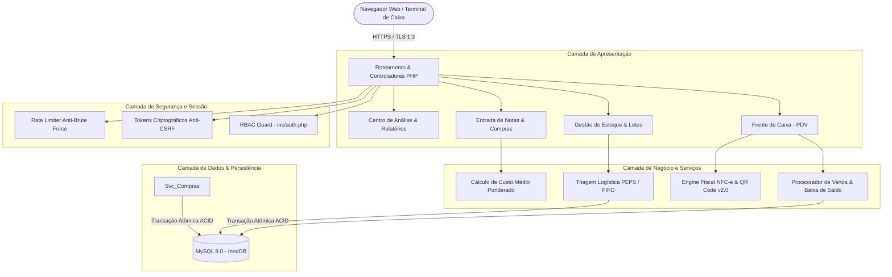
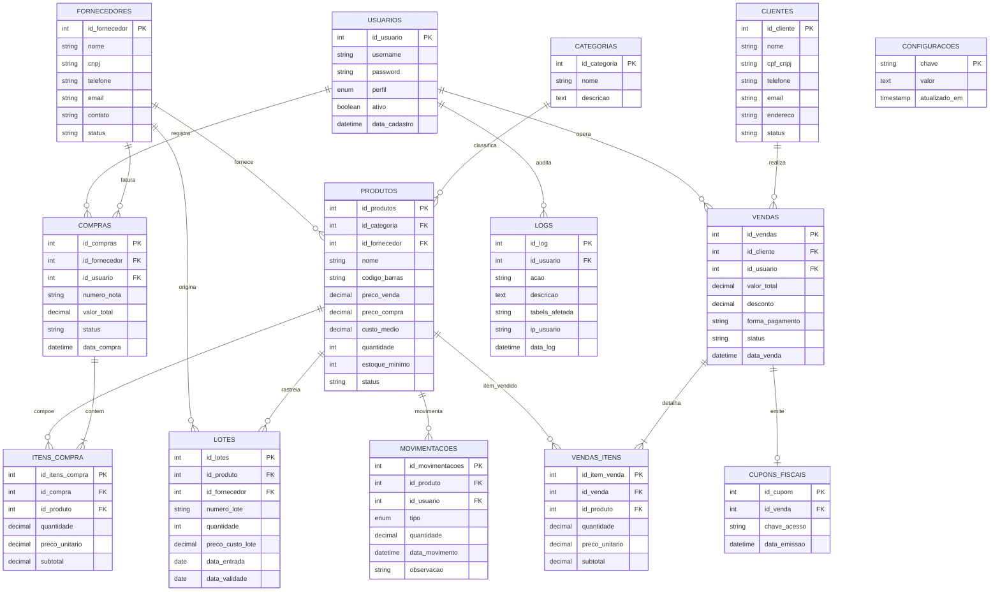

<div align="center">

  

  # MrStock ERP v2.2.0
  
  <p align="center">
    <strong>Sistema Web Integrado de Gestão Empresarial, Controle de Estoque e Ponto de Venda (PDV)</strong>
    <br />
    <em>Trabalho de Conclusão de Curso (TCC) • ETEC Fernando Prestes • Sorocaba/SP</em>
  </p>

  <p align="center">
    <a href="https://www.php.net/releases/8.2/en.php"></a>
    <a href="https://www.mysql.com/"></a>
    <a href="https://getbootstrap.com/"></a>
    <a href="https://www.chartjs.org/"></a>
    <a href="https://fontawesome.com/"></a>
  </p>

  <p align="center">
    
    
    
    
    
    <a href="LICENSE"></a>
  </p>

  <p align="center">
    <a href="#visao-geral">Visão Geral</a> •
    <a href="#estudo-de-caso">Estudo de Caso</a> •
    <a href="#modulos-do-sistema">Módulos</a> •
    <a href="#arquitetura-e-engenharia">Arquitetura</a> •
    <a href="#modelagem-de-dados">Modelo DER (14 Tabelas)</a> •
    <a href="#seguranca-e-integridade">Segurança</a> •
    <a href="#controle-de-acesso-rbac">Perfis RBAC</a> •
    <a href="#instalacao-e-execucao">Instalação</a> •
    <a href="docs/README.md">Documentação</a> •
    <a href="SECURITY.md">Segurança</a> •
    <a href="#equipe-e-orientadores">Equipe & Orientadores</a>
  </p>
</div>

---

## <a id="visao-geral"></a>Visão Geral

O **MrStock ERP** é uma aplicação web desenvolvida em PHP 8.2 nativo com arquitetura relacional MySQL/InnoDB, orientada a suprir demandas operacionais de comércio varejista físico. A plataforma centraliza rotinas de frente de caixa (PDV), controle de estoque com rastreamento de lotes e validades, gestão de compras com atualização automática de custo médio, cadastros comerciais de clientes e fornecedores, inteligência financeira com Curva ABC e DRE, emissão acadêmica de NFC-e com QR Code e trilha de auditoria transacional imutável.

Em produção, o sistema opera sob certificado digital SSL/TLS na infraestrutura da Hostinger através do domínio oficial [mrstock.com.br](https://mrstock.com.br/).

---

## <a id="estudo-de-caso"></a>Estudo de Caso: Papelaria Real Ltda

O desenvolvimento do sistema tomou como base empírica a rotina comercial da **Papelaria Real Ltda**, empresa familiar fundada em 15 de agosto de 1981 em Sorocaba/SP por Sueli Maria Castanho Albuquerque Souza e Osnir.

```
┌────────────────────────────────────────────────────────────────────────────────────────────┐
│                                   PAPELARIA REAL LTDA                                      │
├────────────────────────────────────────────────────────────────────────────────────────────┤
│ • Fundação: 15 de agosto de 1981 • Sorocaba/SP                                             │
│ • Quadro: 5 colaboradores (3 operadores de balcão e 2 proprietários/administradores)       │
│ • Operação: Comércio varejista de materiais escolares, técnicos e suprimentos de escrita   │
│ • Catálogo: Mais de 1.000 itens categorizados em 10 Famílias Funcionais de Produtos        │
│ • Regime Operacional: Balcão físico contínuo com picos sazonais (período de volta às aulas)│
└────────────────────────────────────────────────────────────────────────────────────────────┘
```

### Gargalos Diagnosticados e Soluções Implementadas

| Gargalo Operacional Diagnosticado | Solução no MrStock ERP | Benefício Comprovado |
| :--- | :--- | :--- |
| **Controle manual em cadernos de papel** | Banco de dados centralizado MySQL com interface responsiva | Eliminação de erros manuais de contagem e retrabalho |
| **Perda financeira por produtos vencidos** (colas, tintas guache, corretivos e massinhas) | Módulo de Lotes & Validades com triagem PEPS/FIFO e alerta visual preventivo de 30 dias | Identificação imediata de lotes críticos para liquidação prévia |
| **Filas no balcão em horários de pico** | Ponto de Venda (PDV) com bipagem contínua de código de barras e atalhos F1-F9 | Redução do tempo de checkout para menos de 15 segundos por atendimento |
| **Desorganização física na reposição** | Classificação estruturada em 10 Famílias Funcionais | Localização ágil no estoque espelhando a disposição física da loja |
| **Falta de controle de compras e custos** | Módulo de Ordens de Compra com recálculo automático de Custo Médio Ponderado | Precificação consistente de venda com margem de lucro real |

---

## <a id="modulos-do-sistema"></a>Módulos do Sistema

O sistema conta com 19 interfaces operacionais homologadas:

1. **Dashboard Operacional (`dashboard.php`):** Visão executiva em tempo real com 4 stat cards, atalhos rápidos de navegação e atalhos táteis para o balcão.
2. **Frente de Caixa / PDV (`vendas/pdv.php`):** Interface otimizada para atendimento de balcão com leitor de código de barras, atalhos de teclado (F1 a F9), calculadora de troco com cédulas interativas e impressão térmica (80mm/58mm).
3. **Simulação Fiscal NFC-e (`vendas/nfce.php`):** Painel fiscal para consulta e homologação didática de cupons eletrônicos padrão SEFAZ.
4. **Comprovante de Venda (`vendas/cupom.php`):** Renderização vetorial de comprovante não-fiscal e NFC-e térmica.
5. **Histórico de Vendas (`vendas/historico.php`):** Consulta analítica de transações com filtros temporais, por cliente e cancelamento com estorno automático de estoque.
6. **Catálogo & Produtos (`produtos/index.php`):** Cadastro de itens com precificação, margem de lucro em tempo real e controle de estoque mínimo.
7. **Lotes & Validades (`lotes/index.php`):** Gestão rigorosa de validades por lote com ordenação PEPS (Primeiro que Expira, Primeiro que Sai) e badges de criticidade (vencidos, alerta de 30 dias e válidos).
8. **Gerador de Etiquetas (`produtos/etiquetas.php`):** Geração de etiquetas de gôndola com código de barras Code 128 vetorial e preços.
9. **Categorias Funcionais (`categorias/index.php`):** Gestão das 10 famílias de produtos da Papelaria Real:
   * *Cadernos & Blocos*, *Canetas & Marcadores*, *Lápis & Apontadores*, *Borrachas & Correção*, *Colas & Fitas Adesivas*, *Papéis & Folhas*, *Pastas & Organização*, *Corte & Medição*, *Tintas & Pintura*, *Grampeadores & Fixação*.
10. **Kardex de Movimentações (`produtos/movimentacoes.php`):** Extrato cronológico com registro de todas as entradas, saídas de balcão, perdas e ajustes operacionais com justificativa obrigatória.
11. **Ordens de Compra (`compras/index.php`, `compras/nova.php`, `compras/visualizar.php`):** Gestão mestre-detalhe de abastecimento de fornecedores com registro de notas fiscais e custos de aquisição.
12. **Gestão de Fornecedores (`fornecedores/index.php`):** Cadastro completo com CNPJ, contatos comerciais e atalho de disparo direto para WhatsApp.
13. **Gestão de Clientes (`clientes/index.php`):** Ficha cadastral com validação de CPF/CNPJ, histórico de compras e integração com WhatsApp.
14. **Painel de Análise (`relatorios/analise.php`):** Painel gráfico analítico com Curva ABC de produtos (Pareto 80/15/5), Demonstrativo do Resultado do Exercício (DRE) e ticket médio.
15. **Central de Relatórios (`relatorios/index.php`, `relatorios/pdf.php`, `relatorios/excel.php`):** Emissão de relatórios estruturados para impressão e exportação nos formatos PDF e Excel.
16. **Auditoria & Logs (`relatorios/logs.php`):** Trilha imutável de eventos sensíveis (autenticações, estornos, exclusões e alterações cadastrais) com operador, data/hora e endereço IP.
17. **Central de Ajuda (`ajuda.php`):** Base de instruções e tutorial rápido de operação com tabela tátil de atalhos do PDV.
18. **Privacidade e LGPD (`privacidade.php`, `termos.php`):** Termos de governança e adequação à Lei Geral de Proteção de Dados (Lei nº 13.709/2018).
19. **Configurações Gerais (`configuracoes.php`):** Parâmetros corporativos de cabeçalho, dados fiscais da empresa e rotinas de backup da base de dados.

---

## <a id="arquitetura-e-engenharia"></a>Arquitetura do Sistema

O sistema foi estruturado seguindo boas práticas de desenvolvimento web:



### Princípios Técnicos Fundamentais

* **Transações Atômicas (ACID):** Toda rotina crítica de baixa de estoque e finalização de compra utiliza transações com isolamento de dados (`PDO::beginTransaction()`, `commit()` e `rollBack()`). Em caso de inconsistência de saldo, a transação inteira é abortada sem deixar resíduos no banco.
* **Critério Logístico PEPS/FIFO (Primeiro a Entrar, Primeiro a Sair):** Ordenação prioritária de mercadorias no estoque orientada pelas datas de entrada e validade dos lotes cadastrados, minimizando risco de obsolescência de produtos perecíveis.
* **Custo Médio Ponderado:** Ao registrar uma nova compra com preço unitário diferente do catálogo, o sistema recalcula automaticamente o custo médio contábil com base no saldo anterior e na nova remessa:
  $$\text{Custo Médio} = \frac{(\text{Estoque Anterior} \times \text{Custo Anterior}) + (\text{Quantidade Comprada} \times \text{Novo Custo})}{\text{Estoque Total Atual}}$$
* **Design System Sólido:** Aplicação de botões sólidos de fábrica com alto contraste, fontes locais (*Open Sans* e *Inter*), tipografia numérica tabular (`font-variant-numeric: tabular-nums`) e conformidade com critérios de acessibilidade WCAG 2.1 nível AA.
* **Roll-up Dinâmico de Indicadores (KPIs):** Interpolação suave e contínua de valores numéricos na interface utilizando a biblioteca local Anime.js (`js/anime.min.js`), com formatação monetária brasileira e suporte a `prefers-reduced-motion`.

---

## <a id="modelagem-de-dados"></a>Modelagem de Dados (DER Oficial)

A base de dados `mrstock_db` adota a engine de armazenamento **InnoDB** com integridade referencial estrita (chaves estrangeiras `FOREIGN KEY`), constraints de unicidade (`UNIQUE`) e tipagem decimal exata para evitar erros de ponto flutuante em valores financeiros (`DECIMAL(10,2)`):



---

## <a id="seguranca-e-integridade"></a>Segurança da Aplicação & Governança

1. **Prepared Statements em 100% das Consultas:** Parâmetros SQL tratados com binding de tipo estrito via PDO, erradicando vetores de injeção de SQL (*SQL Injection*).
2. **Tokens Criptográficos Anti-CSRF:** Validação mandatória de tokens em todas as submissões via método `POST` (`csrf_input()` e `csrf_verify()`), impedindo falsificação de solicitações entre sites.
3. **Higienização de Saída contra XSS:** Todas as variáveis de usuário renderizadas no navegador passam por sanitização `htmlspecialchars($var, ENT_QUOTES, 'UTF-8')`.
4. **Criptografia Forte de Senhas:** Hashing unidirecional com algoritmo `password_hash()` utilizando Bcrypt (`PASSWORD_BCRYPT`).
5. **Defesa contra Ataques de Força Bruta:** Sistema de limite de tentativas com bloqueio temporário de requisições por endereço IP (`inc/rate_limiter.php`).
6. **Segredos e Credenciais Fora do Versionamento:** Credenciais de banco de dados e chaves sensíveis residem exclusivamente em arquivos de ambiente `.env`, protegidos contra acesso web via `.htaccess`.

---

## <a id="controle-de-acesso-rbac"></a>Matriz de Perfis de Acesso (RBAC)

O sistema implementa o princípio do menor privilégio e do sigilo comercial através de controle de acesso baseado em papéis (RBAC):

| Módulo / Funcionalidade | Perfil Administrador | Perfil Operador de Caixa | Justificativa de Governança |
| :--- | :---: | :---: | :--- |
| **Frente de Caixa (PDV)** | Sim | Sim | Operação essencial de registro e atendimento de balcão |
| **Consulta de Preço de Venda** | Sim | Sim | Necessário para esclarecimento de valores aos clientes |
| **Consulta de Preço de Custo / Compra** | Sim | **Bloqueado** | **Sigilo Comercial:** Margens de lucro e custos são confidenciais |
| **Gestão de Lotes & Validades** | Sim | Consulta | Permite ao caixa checar validades sem alterar cadastros |
| **Entrada de Ordens de Compra** | Sim | **Bloqueado** | Rotina financeira e de abastecimento restrita à gerência |
| **Cancelamento / Estorno de Vendas** | Sim | **Bloqueado** | Requer autorização de supervisor para evitar fraudes |
| **Painel de Análise / DRE / Curva ABC** | Sim | **Bloqueado** | Informações financeiras exclusivas dos sócios da empresa |
| **Auditoria & Logs Transacionais** | Sim | **Bloqueado** | Rastreabilidade e conformidade gerencial |
| **Configurações Gerais & Backup** | Sim | **Bloqueado** | Preservação da integridade da base de dados |

---

## <a id="instalacao-e-execucao"></a>Instalação e Execução Local

### Requisitos Mínimos de Sistema
* **Servidor Web:** Apache 2.4+
* **Interpretador:** PHP 8.2 ou superior (com extensões ativas: `pdo_mysql`, `mbstring`, `openssl`, `gd`)
* **Banco de Dados:** MySQL 8.0+ ou MariaDB 10.4+
* **Ambiente Recomendado:** XAMPP versão 8.2+

### Procedimento de Instalação

1. **Clonar o Repositório no diretório do servidor web:**
   ```bash
   cd C:/xampp/htdocs/
   git clone https://github.com/mrcodingdev/mrstock-erp.git MrStock
   ```

2. **Criação do Banco de Dados e Carga do Schema:**
   * Acesse o phpMyAdmin (`http://localhost/phpmyadmin/`).
   * Crie uma nova base de dados chamada `mrstock_db` com collation `utf8mb4_unicode_ci`.
   * Importe o script de estrutura e dados iniciais: [`database/mrstock_db.sql`](database/mrstock_db.sql).

3. **Configuração das Variáveis de Ambiente:**
   * Crie o arquivo `.env` na raiz do projeto a partir do modelo [` .env.example`](.env.example):
   ```env
   DB_HOST=localhost
   DB_NAME=mrstock_db
   DB_USER=root
   DB_PASS=
   DB_PORT=3306
   APP_ENV=development
   ```

4. **Execução no Navegador:**
   * Inicie os serviços do Apache e MySQL no painel do XAMPP.
   * Acesse: `http://localhost/MrStock/`

### Credenciais de Acesso Homologadas

| Perfil de Usuário | Login | Senha | Finalidade de Teste |
| :--- | :---: | :---: | :--- |
| **Administrador** | `admin` | `admin` | Acesso completo a compras, relatórios, auditoria e configurações |
| **Operador de Caixa** | `caixa` | `1234` | Acesso restrito ao PDV e consultas de balcão |

---

## <a id="documentacao-academica"></a>Documentação Acadêmica & Anexos do TCC

O projeto conta com documentação técnica completa indexada em [`docs/README.md`](docs/README.md) e arquivos complementares:

* **Centro de Documentação Técnica:** [`docs/README.md`](docs/README.md) (catálogo de arquitetura, 18 módulos detalhados e fluxos).
* **Manual do Usuário Oficial v2.2.0:** [`docs/MRSTOCK_MANUAL_DO_USUARIO_v2.2.0_FINAL.pdf`](docs/MRSTOCK_MANUAL_DO_USUARIO_v2.2.0_FINAL.pdf) (documento ilustrado de 71 páginas contendo sumário próprio, catálogo de 86 figuras, tutorial operacional e passo a passo de todas as telas).
* **Anexo A: Roteiro de Entrevista com o Cliente Piloto:** [`docs/ANEXO_ENTREVISTA_LEVANTAMENTO_REQUISITOS_PAPELARIA_REAL.pdf`](docs/ANEXO_ENTREVISTA_LEVANTAMENTO_REQUISITOS_PAPELARIA_REAL.pdf) (instrumento de Engenharia de Requisitos com 24 perguntas e respostas chanceladas pelos proprietários da Papelaria Real).
* **Relatório Técnico de Banco de Dados:** [`docs/RELATORIO_TECNICO_BANCO_DE_DADOS_NIKOLAS.pdf`](docs/RELATORIO_TECNICO_BANCO_DE_DADOS_NIKOLAS.pdf).
* **Relatório Técnico de Lotes & Validades:** [`docs/RELATORIO_TECNICO_MODULO_LOTES_E_VALIDADES.pdf`](docs/RELATORIO_TECNICO_MODULO_LOTES_E_VALIDADES.pdf).
* **Política de Segurança:** [`SECURITY.md`](SECURITY.md) (diretrizes de reporte responsável de vulnerabilidades e SLAs).

---

## <a id="governanca-e-padroes"></a>Governança do Repositório & Qualidade de Código

O repositório adota boas práticas de organização e padronização de código:

* **Templates Padronizados de Issues & PR:** Formulários estruturados em [`.github/ISSUE_TEMPLATE/`](.github/ISSUE_TEMPLATE/) e checklist operacional em [`.github/PULL_REQUEST_TEMPLATE.md`](.github/PULL_REQUEST_TEMPLATE.md).
* **Normalização de Linhas & Binários:** Configuração explícita de fim de linha (LF) e tipos binários em [`.gitattributes`](.gitattributes).
* **Padronização de Código Multi-IDE:** Diretrizes de indentação e espaçamento em [`.editorconfig`](.editorconfig).
* **Propriedade de Código:** Mapeamento de responsáveis por módulo em [`.github/CODEOWNERS`](.github/CODEOWNERS).

---

## <a id="equipe-e-orientadores"></a>Equipe do Projeto & Orientadores

Trabalho de Conclusão de Curso (TCC) apresentado ao curso Técnico em Desenvolvimento de Sistemas da **ETEC Fernando Prestes** (Centro Estadual de Educação Tecnológica Paula Souza, Sorocaba/SP):

### Integrantes (Equipe Mr. Coding)
* **Cesar Augusto da Silva Junior:** *Levantamento de Requisitos e Relações com o Cliente*
* **Douglas Moraes Braz:** *Desenvolvimento Web e Programação Full-Stack*
* **Eduardo Sugahara Neto:** *Testes de Usabilidade e Apresentação do Sistema*
* **Enzo de Oliveira Soares:** *Documentação do Projeto e Casos de Uso*
* **Nikolas Pires Brandão:** *Banco de Dados e Modelagem DER*

### Orientadores Acadêmicos
* **Prof. Luiz Flávio de Almeida:** *Orientação Metodológica e Governança de TCC*
* **Prof. Vinicius Sewaybricker:** *Orientação Técnica e Engenharia de Sistemas*

---

## Licença

Distribuído sob os termos da licença **MIT**. Consulte o arquivo [`LICENSE`](LICENSE) para mais informações.

<div align="center">
  <sub>MrStock ERP v2.2.0 • Papelaria Real Ltda • ETEC Fernando Prestes 2026</sub>
</div>
