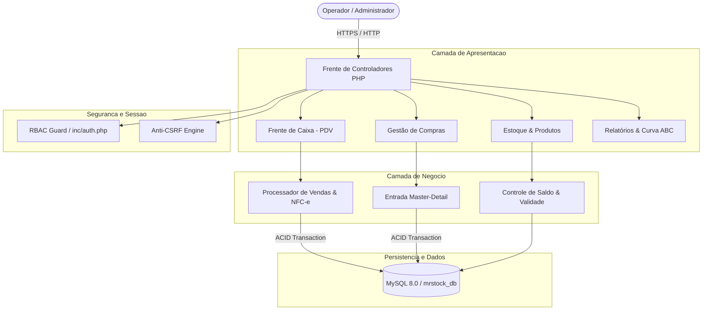

<div align="center">

  

  # MrStock ERP v2.0
  
  <p align="center">
    <strong>Plataforma Integrada de Gestão Empresarial, Controle de Estoque e Frente de Caixa (PDV)</strong>
    <br />
    <em>Engenharia de software aplicada ao comércio varejista físico com transações ACID, simulação fiscal de NFC-e e governança de dados.</em>
  </p>

  <!-- STACK TECNOLÓGICA -->
  <p align="center">
    <a href="https://www.php.net/releases/8.2/en.php"></a>
    <a href="https://www.mysql.com/"></a>
    <a href="https://getbootstrap.com/"></a>
    <a href="https://www.chartjs.org/"></a>
    <a href="https://fontawesome.com/"></a>
  </p>

  <!-- GOVERNANÇA & SEGURANÇA -->
  <p align="center">
    <a href="#seguranca-e-integridade"></a>
    <a href="#controle-de-acesso-rbac"></a>
    <a href="#frente-de-caixa-pdv"></a>
    <a href="LICENSE"></a>
    <a href="#roadmap-de-evolucao"></a>
  </p>

  <!-- SUMÁRIO EXECUTIVO DE NAVEGAÇÃO -->
  <p align="center">
    <a href="#visao-geral">Visão Geral</a> •
    <a href="#pilares-de-engenharia">Pilares Técnicos</a> •
    <a href="#arquitetura-do-sistema">Arquitetura</a> •
    <a href="#modulos-do-sistema">Módulos</a> •
    <a href="#controle-de-acesso-rbac">Matriz RBAC</a> •
    <a href="#modelagem-de-dados">Modelo de Dados</a> •
    <a href="#seguranca-e-integridade">Segurança</a> •
    <a href="#instalacao-e-execucao">Instalação</a> •
    <a href="#equipe-e-creditos">Equipe</a>
  </p>
</div>

---

## <a id="visao-geral"></a>📌 Visão Geral & Estudo de Caso

O **MrStock ERP** é uma solução completa de gestão empresarial e frente de caixa voltada para o varejo de pequeno e médio porte. O projeto foi concebido e modelado com base nas necessidades operacionais da **Papelaria Real**, um estabelecimento varejista com alto volume de itens cadastrados, produtos fracionados e controle sazonal de compras.

```
┌────────────────────────────────────────────────────────────────────────────────────────┐
│                                   PAPELARIA REAL                                       │
├────────────────────────────────────────────────────────────────────────────────────────┤
│  • +1.000 SKUs ativos divididos em 10 Famílias Funcionais de Produtos                 │
│  • Picos sazonais de atendimento (Volta às Aulas) exigindo PDV com resposta instantânea│
│  • Risco de perdas em itens perecíveis (colas, tintas, corretivos, borrachas)         │
│  • Necessidade de emissão ágil de NFC-e e impressão térmica padronizada               │
└────────────────────────────────────────────────────────────────────────────────────────┘
```

### 🎯 Principais Dores Solucionadas
1. **Velocidade de Checkout:** Redução do tempo de fila no PDV via leitura contínua de código de barras, atalhos de teclado (`F1` a `F9`) e cálculo dinâmico de troco.
2. **Ruptura de Estoque:** Controle de estoque mínimo com alertas visuais e filtros rápidos por status.
3. **Gestão de Validade:** Painel executivo que sinaliza automaticamente produtos a vencer em até 30 dias.
4. **Sigilo Comercial:** Operador de caixa executa vendas com excelência sem ter acesso a preços de custo ou margens de lucro.

---

## <a id="pilares-de-engenharia"></a>⚡ Pilares de Engenharia de Software

```
   ┌───────────────────────┐   ┌───────────────────────┐   ┌───────────────────────┐
   │    TRANSAÇÕES ACID    │   │     ANTI-SLOP UX      │   │     GOVERNANÇA RBAC   │
   │  Isolamento InnoDB no │   │  Design System Sólido │   │  Segregação estrita   │
   │  checkout e entradas  │   │  com tipografia tnum  │   │  de perfis comerciais │
   └───────────────────────┘   └───────────────────────┘   └───────────────────────┘
```

* **Transações Atômicas (ACID):** Toda operação de compra ou venda utiliza `PDO::beginTransaction()`, `commit()` e `rollBack()`. Se ocorrer qualquer interrupção, o estoque e o saldo financeiro são revertidos instantaneamente.
* **Tipografia Tabular (`tnum`):** Todos os valores monetários (`R$`), quantidades, códigos de barras e datas utilizam `font-variant-numeric: tabular-nums`, garantindo alinhamento vertical perfeito em tabelas e cupons fiscais.
* **Design System Corporativo:** Botões 100% sólidos com contraste acessível (WCAG 2.1 AA), ausência de contornos transparentes e navegação suave.

---

## <a id="arquitetura-do-sistema"></a>🏗️ Arquitetura do Sistema

O sistema adota uma arquitetura em camadas orientada a serviços leves com **PHP 8.2 Nativo / PDO / MySQL 8.0**:



---

## <a id="modulos-do-sistema"></a>📦 Módulos do Sistema

<details open>
<summary><b>🛒 1. Frente de Caixa & Ponto de Venda (PDV)</b></summary>
<br>

O PDV foi desenvolvido para operação contínua e ágil no balcão:
* **Bipagem e Busca Inteligente:** Adição de itens via leitor de código de barras com confirmação sonora (`Web Audio API`) e busca preditiva.
* **Atalhos Operacionais de Teclado:**
  * <kbd>F1</kbd> — Ajuda rápida e catálogo de atalhos.
  * <kbd>F2</kbd> — Foco imediato na busca de produtos.
  * <kbd>F4</kbd> — Aplicação de desconto percentual ou em valor fixo (R$).
  * <kbd>F8</kbd> — Abertura do modal de fechamento e recebimento.
  * <kbd>F9</kbd> — Consulta rápida de clientes e CPF.
  * <kbd>ESC</kbd> — Cancelamento de item ou saída de modais.
* **Simulação de NFC-e:** Emissão de cupom fiscal acadêmico com chave de 44 dígitos, protocolo de autorização e **QR Code de Consulta Pública**.
* **Fechamento e Troco Dinâmico:** Teclado com botões rápidos de cédulas (R$ 5, R$ 10, R$ 20, R$ 50, R$ 100, R$ 200) e cálculo em tempo real do troco.
</details>

<details>
<summary><b>📦 2. Gestão de Estoque & Catálogo</b></summary>
<br>

* **10 Famílias Funcionais de Produtos:** Organização especializada para papelarias:
  1. *Cadernos & Blocos*
  2. *Canetas & Marcadores*
  3. *Lápis & Apontadores*
  4. *Borrachas & Correção*
  5. *Colas & Fitas Adesivas*
  6. *Papéis & Folhas*
  7. *Pastas & Organização*
  8. *Corte & Medição*
  9. *Tintas & Pintura*
  10. *Grampeadores & Fixação*
* **Barra Unificada de Filtros (1 Linha):** Busca textual ao vivo, filtro por categoria, fornecedor e status do estoque com submissão automática.
* **Etiquetas de Código de Barras:** Geração de folhas de etiquetas prontas para impressoras térmicas e convencionais.
* **Alerta de Validade em 30 Dias:** Identificação imediata de lotes perecíveis.
</details>

<details>
<summary><b>📑 3. Gestão de Compras & Abastecimento (Master-Detail)</b></summary>
<br>

* **Lançamento de Notas de Entrada:** Interface master-detail dinâmica permitindo inclusão de múltiplos produtos em uma única nota.
* **Recálculo Automático de Preços:** Atualização do preço de custo, margem e preço sugerido de venda com incremento automático de saldo no estoque em transação atômica.
</details>

<details>
<summary><b>📊 4. Inteligência Financeira, Curva ABC & DRE</b></summary>
<br>

* **Curva ABC de Produtos:** Separação analítica do catálogo em Classe A (80% da receita), Classe B (15%) e Classe C (5%), permitindo compras estratégicas.
* **DRE Gerencial:** Demonstrativo com Receita Bruta, Deduções, Custo da Mercadoria Vendida (CMV) e Lucro Operacional Líquido.
* **Histórico de Vendas com Auditoria:** Rastreabilidade de vendas com cancelamento auditado e estorno automático de mercadorias para o estoque.
</details>

<details>
<summary><b>👥 5. Cadastros Comerciais & CRM</b></summary>
<br>

* **Clientes e Fornecedores:** Validação automática com máscaras de CPF, CNPJ, CEP e telefone.
* **Integração WhatsApp:** Botão circular padronizado para abertura direta de conversas no WhatsApp Web em 1 clique.
</details>

---

## <a id="controle-de-acesso-rbac"></a>🔐 Matriz de Perfis de Acesso (RBAC)

O sistema conta com barreira de autorização estrita em nível de rota e de renderização de interface:

| Rota / Módulo do Sistema | Administrador | Operador de Caixa | Justificativa Operacional |
| :--- | :---: | :---: | :--- |
| `vendas/pdv.php` (Frente de Caixa) | ✅ Permitido | ✅ Permitido | Operação central de atendimento e vendas |
| `vendas/historico.php` | ✅ Todas as Vendas | ✅ Apenas Vendas Próprias | Auditoria de turno do operador |
| `produtos/index.php` (Preço de Venda) | ✅ Visualiza | ✅ Visualiza | Consulta de preços no balcão |
| `produtos/` (Preço de Custo / Lucro) | ✅ Visualiza | ❌ Bloqueado | **Sigilo Comercial:** Caixa não visualiza margem |
| `compras/` (Entrada de Notas) | ✅ Total | ❌ Bloqueado | Abastecimento restrito à gerência |
| `relatorios/curva_abc.php` | ✅ Total | ❌ Bloqueado | Inteligência financeira estratégica |
| `relatorios/dre.php` | ✅ Total | ❌ Bloqueado | Demonstrativo contábil restrito |
| `configuracoes.php` / Backup SQL | ✅ Total | ❌ Bloqueado | Governança e segurança do banco de dados |

---

## <a id="modelagem-de-dados"></a>🗄️ Modelagem de Dados (`mrstock_db`)

O banco de dados foi modelado para integridade referencial rigorosa com tabelas em conformidade com as Formas Normais:

```
mrstock_db
├── categorias       (id, nome, descricao, icone)
├── fornecedores     (id, nome, cnpj, email, telefone, endereco, status)
├── clientes         (id, nome, cpf, email, telefone, endereco, status)
├── produtos         (id, nome, codigo_de_barra, categoria_id, fornecedor_id, 
│                     preco_custo, preco_venda, quantidade, estoque_minimo, validade, status)
├── compras          (id, fornecedor_id, valor_total, data_compra, status, usuario_id)
├── itens_compra     (id, compra_id, produto_id, quantidade, preco_unitario, subtotal)
├── vendas           (id, cliente_id, usuario_id, valor_total, desconto, valor_pago, troco,
│                     forma_pagamento, chave_nfce, data_venda, status)
├── itens_venda      (id, venda_id, produto_id, quantidade, preco_unitario, subtotal)
├── configuracoes    (id, nome_empresa, cnpj, endereco, telefone, mensagem_cupom)
└── usuarios         (id, nome, email, senha, perfil, status)
```

---

## <a id="seguranca-e-integridade"></a>🛡️ Segurança e Integridade

1. **Prepared Statements PDO:** Eliminação completa de vetores de SQL Injection com binding explícito de variáveis (`PDO::PARAM_INT`, `PDO::PARAM_STR`).
2. **Tokens Anti-CSRF:** Validação de autenticidade em todas as submissões POST através de `csrf_input()` e `csrf_verify()`.
3. **Escapamento contra XSS:** Todas as variáveis de saída são tratadas com `htmlspecialchars($d, ENT_QUOTES, 'UTF-8')`.
4. **Criptografia Bcrypt:** Armazenamento seguro de senhas com algoritmo nativo `password_hash()`.
5. **Transações InnoDB:** Isolamento de concorrência e garantia de consistência de saldo.

---

## <a id="instalacao-e-execucao"></a>⚙️ Instalação e Execução Local

### Pré-requisitos
* **XAMPP** (ou Apache 2.4+ / PHP 8.2+ / MySQL 8.0+).
* Extensões PHP obrigatórias: `pdo_mysql`, `mbstring`, `openssl`, `gd`.

### Passo a Passo

1. **Clonar o Repositório no `htdocs`:**
   ```bash
   cd C:/xampp/htdocs/
   git clone https://github.com/mrcodingdev/mrstock-erp.git MrStock
   ```

2. **Criar a Base de Dados e Importar o Schema:**
   * Acesse o phpMyAdmin em `http://localhost/phpmyadmin/`.
   * Crie o banco de dados: `mrstock_db`.
   * Importe o script inicial: [`database/mrstock_db.sql`](database/mrstock_db.sql).

3. **Configuração de Ambiente:**
   * O sistema já está configurado por padrão para conexão local (`localhost`, usuário `root`, sem senha, porta `3306`).
   * Para personalizar URLs ou credenciais, edite [`config.php`](config.php) e [`inc/database.php`](inc/database.php).

4. **Acessar o ERP:**
   * Abra no navegador: `http://localhost/MrStock/`

### 🔑 Credenciais de Teste Homologadas

| Perfil | Usuário | Senha | Acesso |
| :--- | :---: | :---: | :--- |
| **Administrador** | `admin` | `admin` | Acesso irrestrito a todos os módulos, compras, DRE e configurações |
| **Operador de Caixa** | `caixa` | `caixa` | Acesso operacional restrito ao PDV e consultas de balcão |

---

## <a id="roadmap-de-evolucao"></a>🗺️ Roadmap de Evolução

* [x] **v1.0** — Estrutura base de Frente de Caixa e Cadastros.
* [x] **v2.0 (Versão Oficial do TCC)** — Transações ACID, Simulação Fiscal NFC-e com QR Code, Curva ABC, DRE, Barra de Filtros em 1 Linha e Design System Sólido em PHP 8.2 Nativo / PDO.
* [ ] **v3.0 (Trabalhos Futuros)** — Migração da arquitetura para o framework **Laravel**, integração com API oficial de emissão fiscal (Focus NFe / SEFAZ via certificado A1) e aplicativo mobile para inventário.

---

## <a id="equipe-e-creditos"></a>👥 Equipe do Projeto & Créditos Acadêmicos

Projeto concebido e desenvolvido como **Trabalho de Conclusão de Curso (TCC)** no curso Técnico em Desenvolvimento de Sistemas da **ETEC**:

* **Douglas** — *Direção Técnica, Arquitetura de Software, Engenharia Backend & Frontend*
* **Nikolas** — *Engenharia de Banco de Dados, Modelagem DER e Otimização SQL*
* **Cesar** — *Levantamento de Requisitos, Modelagem de Negócio e Relações Comerciais*
* **Enzo** — *Engenharia de Documentação, Casos de Uso e Roteiros de Testes QA*
* **Sugahara** — *Validação de Usabilidade, Navegação do Sistema e Demonstração Executiva*
* **Prof. Vinicius** — *Orientação Técnica e Acadêmica*

---

## 📄 Licença

Distribuído sob a licença **MIT**. Veja o arquivo [`LICENSE`](LICENSE) para mais detalhes.

<div align="center">
  <sub>MrStock ERP v2.0 • Papelaria Real • ETEC 2026</sub>
</div>


