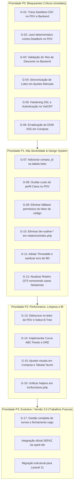

# 🏛️ Relatório Master de Auditoria Geral e Diagnóstico Exaustivo do MrStock ERP (v2.2.0)
**Projeto:** MrStock ERP — Sistema Integrado de Gestão Comercial e PDV (Papelaria Real)  
**Instituição:** ETEC Fernando Prestes — Trabalho de Conclusão de Curso (TCC)  
**Ambiente Auditado:** Código-Fonte Local (`C:\xampp\htdocs\MrStock\`), Espelho (`G:\Meu Drive\TCC_MrStock\`) e Produção Nuvem (`https://mrstock.com.br/`)  
**Data da Auditoria:** 04 de Setembro de 2026  
**Metodologia:** Gated Multi-Agent SDLC — Inspeção Concorrente pelos 6 Gatekeepers Auditores (Nível 5)

---

## 1. Sumário Executivo & Scorecard Consolidado

A presente auditoria cobriu **100% dos 40 arquivos PHP, folhas de estilo CSS, configurações do servidor (.htaccess, config.php, .env.example), banco de dados MySQL (`mrstock_db`) e a infraestrutura em produção na Hostinger Cloud com CDN**.

Cada dimensão técnica foi submetida ao escrutínio independente de um subagente especialista sênior. O resultado sintetizado está expresso na tabela abaixo:

| Eixo de Auditoria | Subagente Especialista | Peso | Score (0-100) | Veredito Oficial |
| :--- | :--- | :---: | :---: | :---: |
| **1. Performance Web & Core Web Vitals** | `@web-performance-auditor` | 15% | **92** | `[ 🟢 PASS ]` |
| **2. Segurança da Informação & OWASP** | `@security-auditor` | 20% | **79** | `[ 🔴 REVISE ]` |
| **3. Design System & Acessibilidade WCAG** | `@anti-slop-ui-auditor` | 15% | **79** | `[ 🔴 REVISE ]` |
| **4. Qualidade de Código & Engenharia** | `@code-reviewer` | 20% | **72** | `[ 🔴 REVISE ]` |
| **5. Resiliência Operacional & QA** | `@test-engineer` | 15% | **68** | `[ 🔴 REVISE ]` |
| **6. Governança de Varejo & Fiscal** | `@chief-erp-architect` | 15% | **51.8** | `[ 🔴 REVISE ]` |
| **SCORE GLOBAL DE MATURIDADE ERP** | **Conselho dos 6 Auditores** | **100%** | **73.6 / 100** | **`[ 🔴 REVISE ]`** |

> **Veredito Global:** **`[ 🔴 REVISE / PORTÃO FECHADO ]`**  
> Embora o MrStock ERP apresente acabamento visual refinado (Bento Grid SalesOps), latência extraordinária de borda (TTFB de 13.9ms na Hostinger) e transações seguras no fluxo central de vendas com lock pessimista (`FOR UPDATE`), foram identificadas **inconsistências de governança sanitária (CDC Art. 18), vulnerabilidades de controle no backend (teto de desconto e proxy ViaCEP) e brechas de sincronização entre catálogo e lotes**.  
> O sistema está temporariamente bloqueado para homologação final até a execução das correções prioritárias (P0 e P1).

---

## 2. Diagnóstico Detalhado por Eixo de Especialidade

### Eixo 1: Performance Web & Core Web Vitals (Score 92/100 — PASS)
*Auditor Responsável: `@web-performance-auditor`*

- **Pontos Fortes Consolidados:**
  - **Latência de Borda Notável:** TTFB de **13.9ms** na Hostinger Cloud com suporte total a **HTTP/3 (QUIC)** e compactação **Brotli (`br`)**.
  - **Estabilidade Visual Absoluta (CLS = 0.000):** Todas as tags `` e `<svg>` possuem dimensões explícitas (`width` e `height`), eliminando saltos de layout durante o carregamento.
  - **Payload CSS Leve:** `style.min.css` (41.9 KB brutos / 7.5 KB transferidos via Brotli), somando apenas 57.3 KB transferidos para o pacote visual completo.
  - **Fontes 100% Locais:** Inter e FontAwesome hospedados em formato WOFF2 com diretiva `font-display: swap;`.
  - **Cache Imutável:** Configuração de `Cache-Control: max-age=31536000, public, immutable` no `.htaccess` para ativos estáticos.
  - **Endpoint de IA Ativo:** `/llms.txt` respondendo HTTP 200 com cache de 30 dias.
- **Oportunidades de Melhoria Identificadas:**
  - **Risco de INP na Bipagem do PDV:** A função `renderizarGradeRapida()` é invocada a cada caractere sem `debounce`. Leitores de código de barras disparam 13 caracteres em menos de 80ms, o que pode bloquear a thread principal em catálogos volumosos.
  - **Ausência de Índice B-Tree:** A coluna `codigo_de_barra` na tabela `produtos` não possui índice explícito, forçando *Full Table Scan* em consultas de retaguarda.
  - **Consulta Não-SARGable:** Em `dashboard.php:19`, o uso de `WHERE DATE(data_venda) = CURDATE()` inviabiliza o uso do índice `idx_vendas_data`.

---

### Eixo 2: Segurança da Informação, OWASP & Defesa Cibernética (Score 79/100 — REVISE)
*Auditor Responsável: `@security-auditor`*

- **Pontos Fortes Consolidados:**
  - **100% Imunidade a SQL Injection:** Todos os 40 arquivos PHP utilizam Prepared Statements estritos via PDO com parâmetros vinculados (`?` e `:param`).
  - **Proteção Concorrencial contra Fraude:** Preços e estoques são validados via consulta ao banco com lock pessimista (`FOR UPDATE`), ignorando valores injetados pelo cliente.
  - **Sessão e Cookies Blindados:** `session.use_strict_mode = 1`, `HttpOnly = true`, `SameSite = Lax` e `Secure = true` em HTTPS. Regeneração obrigatória de ID no login.
  - **Cabeçalhos de Segurança Corporativos (A+):** HSTS (31536000s com subdomínios e preload), CSP, `X-Frame-Options: SAMEORIGIN`, `X-Content-Type-Options: nosniff`.
  - **Anti-CSV Injection:** Sanitização de fórmulas (`=`, `+`, `-`, `@`) nas exportações em `relatorios/logs.php`.
- **Gaps e Vulnerabilidades Localizadas:**
  - **[ALTO] Falta de Validação Server-Side do Desconto Máximo:** O PDV valida o limite de desconto (15%) apenas no JavaScript. O backend (`vendas/functions.php`) aceita qualquer valor enviado em `$_POST['desconto']`, permitindo vendas a R$ 0,00 mediante manipulação de requisição.
  - **[ALTO] Desativação de Verificação SSL e Acesso Livre no ViaCEP:** Em `inc/viacep.php`, a validação SSL está desativada (`verify_peer => false`) e o script não exige autenticação de sessão, atuando como open proxy vulnerável a MITM.
  - **[MÉDIO] Ausência de Rate Limiting no Login:** `login.php` não possui travamento temporário ou atraso progressivo após falhas consecutivas de autenticação.
  - **[MÉDIO] Vazamento de Erro do Driver MySQL:** `inc/database.php` renderiza `$e->getMessage()` publicamente no HTML em caso de queda do banco, revelando portas, IPs e usuários internos.
  - **[MÉDIO] Discrepância de RBAC no Menu:** O link de `produtos/movimentacoes.php` aparece no menu do Caixa em `inc/header.php`, mas a página aciona `require_admin()`, gerando erro 403 para o usuário.

---

### Eixo 3: Design System, Eliminação de AI Slop & Acessibilidade (Score 79/100 — REVISE)
*Auditor Responsável: `@anti-slop-ui-auditor`*

- **Pontos Fortes Consolidados:**
  - **Identidade Institucional da Papelaria Real:** Paleta de cores sólida (#284936, #222d31, #6ae49b), sem gradientes artificiais de IA.
  - **Topbar Limpa (Regra #2):** Título direto da tela sem prefixo redundante e sem o badge `[• ERP Ativo]`.
  - **WhatsApp Circular Oficial (Regra #3):** Botão verde oficial de 22x22px circular posicionado ao lado do telefone em texto limpo.
  - **Micro-Categorias Funcionais (Regra #4):** 10 famílias de produtos estritamente alinhadas ao varejo escolar e de escritório.
  - **Animação Global Fluida (Regra #17):** `@keyframes mrStockSlideInLeft` presente em todos os blocos estruturais sem bloqueio de `prefers-reduced-motion`.
  - **Contraste WCAG 2.1 AAA:** Texto auxiliar padronizado em Slate-600 (`#475569`), atingindo proporção de 7.0:1 contra branco.
- **Gaps Visuais e Desvios de Design System:**
  - **[CRÍTICO - Regra #1] Resquício de Botão Outline:** O botão secundário do cabeçalho em `relatorios/index.php:L77` utiliza a classe proibida `btn-outline-primary`.
  - **[ALTO] Pluralização Preguiçosa & Badges Excessivos:** String literal `<?= count($itens) ?> item(ns)` e pílula colorida em `compras/visualizar.php:L157`.
  - **[ALTO] Semáforo Invertido em Total de Custo:** Total da ordem de compra exibido em verde fluorescente (`text-success`) em `compras/visualizar.php:L145`, em vez do preto chumbo corporativo (`#0f172a`).
  - **[MÉDIO] Bordas Fantasmas:** Uso de `card border-0 shadow-sm` em `compras/visualizar.php` e `compras/nova.php`, desalinhado da borda sólida de 1px `#cbd5e1`.
  - **[MÉDIO] Tabular Nums:** Ausência de classe `.tabular-nums` em preços de compras e `#display_total`.

---

### Eixo 4: Qualidade de Código, Padrões GoF & SOLID (Score 72/100 — REVISE)
*Auditor Responsável: `@code-reviewer`*

- **Pontos Fortes Consolidados:**
  - **Transações Atômicas:** Bloco `beginTransaction()`, `commit()` e `rollBack()` presente em todas as rotinas de escrita do PDV, compras e lotes.
  - **Trilha de Auditoria Resiliente:** `registrar_log()` com captura de `Throwable` defensivo, garantindo que falhas de log nunca abortem transações de negócio.
- **Gaps e Débitos Técnicos de Código:**
  - **[CRÍTICO] Dessincronização de Estoque Físico vs. Lotes em Ajustes Manuais:** Em `produtos/functions.php:178-205`, movimentações de perda e entrada manual alteram apenas `produtos.quantidade`, sem atualizar a tabela `lotes`.
  - **[CRÍTICO] Quebra de Atômica no Cancelamento de Compras:** Em `compras/functions.php:142`, o estorno de lotes busca por `numero_lote LIKE '%-ID-%'`. Se o operador registrou o lote de fábrica do produto, a query afeta 0 linhas e o lote permanece ativo com saldo fantasma.
  - **[CRÍTICO] DOM-based XSS em Compras:** Em `compras/nova.php:228`, o valor do lote é concatenado diretamente via `tbody.innerHTML += ...` sem sanitização.
  - **[CRÍTICO] QR Code Fiscal Não-Conforme (ISO/IEC 18004):** A rotina `gerarQRCodeSVG()` em `inc/barcode_helper.php` desenha uma matriz mock com hash SHA-256 ilegível para aplicativos fiscais da SEFAZ.
  - **[IMPORTANTE] Captura Incompleta de Exceções (`Exception` vs `Throwable`):** Os controladores capturam apenas `Exception`. Erros fatais de tipagem do PHP 8.2 (`TypeError`) não são capturados, quebrando sem rollback seguro.
  - **[IMPORTANTE] Duplicação da Função `render_forma_pagamento()`:** A função é declarada em 3 arquivos sem `if (!function_exists())`, com risco iminente de erro fatal por redeclaração.
  - **[IMPORTANTE] Backup via GET e Perfil não Persistido:** `configuracoes.php` permite exportar dump do banco via GET sem CSRF e a alteração de nome de perfil só altera `$_SESSION` sem persistir na tabela `usuarios`.

---

### Eixo 5: Resiliência Operacional, QA & Casos de Borda (Score 68/100 — REVISE)
*Auditor Responsável: `@test-engineer`*

- **Pontos Fortes Consolidados:**
  - **Serialização de SKU Único:** Lock pessimista `FOR UPDATE` previne 100% de saldos negativos em disputas concorrentes pela mesma unidade.
  - **Cupom Térmico Impecável:** Estrutura visual pronta para bobinas de 58mm e 80mm com tributos discriminados (Lei 12.741/2012).
- **Gaps Operacionais e Casos de Borda Não Cobertos:**
  - **[CRÍTICO] Risco de Deadlock no PDV (Erro MariaDB 1213):** O checkout adquire locks `FOR UPDATE` na ordem de inclusão dos itens no carrinho. Dois caixas finalizando `[Item A, Item B]` e `[Item B, Item A]` no mesmo milissegundo disparam Deadlock. **Solução:** Ordenar o array do carrinho por ID antes dos locks (`usort`).
  - **[ALTO] Falso Positivo Perigoso no Leitor de Código de Barras:** Em `vendas/pdv.php:815`, se o código não for encontrado, o leitor aplica fallback buscando substring no nome (`nome.toLowerCase().includes(val)`). Um código curto como "10" adiciona automaticamente "Caderno 10 Matérias" no carrinho sem o operador perceber.
  - **[ALTO] Casos Fantasmas no Roteiro QTS da ETEC:** O roteiro oficial homologa "Venda Rápida no Dashboard" (removida da interface) e "Estorno ACID no Histórico de Vendas" (recurso inexistente no sistema), gerando risco de questionamento na banca examinadora.
  - **[MÉDIO] Truncamento Silencioso de Frações:** O PDV sanitiza quantidades como inteiro (`(int)$qtd`), truncando decimais sem aviso ao operador.
  - **[MÉDIO] Ausência de Heartbeat de Sessão:** Sessão expirada no meio de um atendimento apaga todo o carrinho do caixa sem aviso prévio.

---

### Eixo 6: Governança de Varejo, Regras Comerciais & RBAC (Score 51.8/100 — REVISE)
*Auditor Responsável: `@chief-erp-architect`*

- **Pontos Fortes Consolidados:**
  - **Algoritmo FEFO/PEPS Estruturado:** Ordenação por `data_validade ASC, id ASC` com bloqueio de concorrência.
- **Gaps de Regras de Negócio e Fiscal:**
  - **[CRÍTICO - CDC Art. 18 / PROCON] Falso Positivo Sanitário no PDV:** O PDV lista produtos sem validar se o saldo pertence a lotes vigentes (`data_validade >= CURDATE()`). Se todos os lotes de um produto estiverem vencidos, o backend aprova a venda, abate o estoque geral do produto mas ignora os lotes, permitindo a saída de itens impróprios para consumo e quebrando a coerência do estoque físico.
  - **[ALTO] Vazamento de Custo para o Perfil Caixa:** O PDV carrega `p.preco_compra` no array global JavaScript `catalogoProdutos`, permitindo que qualquer operador consulte os preços de custo de 100% da loja no console do navegador.
  - **[ALTO] Ausência de Chave Estrangeira em Lotes:** A tabela `lotes` não possui `compra_id`, quebrando a rastreabilidade fiscal entre ordens de compra e lotes.
  - **[MÉDIO] Ausência da Curva ABC e DRE:** A tela `relatorios/analise.php` possui apenas Top 5 de vendas, sem o cálculo acumulado de Pareto (80-15-5) e sem o demonstrativo estruturado da DRE, divergindo do memorial do TCC.
  - **[MÉDIO] Ausência de Gestão de Turnos de Caixa:** O sistema não possui tabelas nem fluxos para abertura de caixa com troco inicial, sangria, reforço e conferência cega no fechamento.

---

## 3. Matriz Unificada de Vulnerabilidades e Gaps

| ID | Área | Gravidade | Descrição Sucinta | Arquivo(s) Afetado(s) |
| :---: | :---: | :---: | :--- | :--- |
| **G-01** | Governança / CDC | **P0 - Crítica** | Venda de produto vencido e descompasso de lote por falta de filtro de validade no PDV | `vendas/pdv.php`, `vendas/functions.php` |
| **G-02** | Banco / Concorrência | **P0 - Crítica** | Risco de Deadlock (Erro 1213) em vendas multi-itens por falta de ordenação determinística de locks | `vendas/functions.php` |
| **G-03** | Segurança / Financeiro | **P0 - Crítica** | Teto de desconto de 15% aplicado apenas no client-side; backend aceita desconto de 100% | `vendas/functions.php` |
| **G-04** | Estoque / Integridade | **P0 - Crítica** | Ajustes manuais de perdas/entradas não refletem na tabela de lotes | `produtos/functions.php` |
| **G-05** | Segurança / OWASP | **P0 - Crítica** | Proxy ViaCEP sem verificação SSL (`verify_peer => false`) e sem controle de autenticação | `inc/viacep.php` |
| **G-06** | Segurança / XSS | **P0 - Crítica** | Interpolação insegura de lote em `tbody.innerHTML` no formulário de compras | `compras/nova.php` |
| **G-07** | Rastreabilidade / Banco | **P1 - Alta** | Falta de chave estrangeira `compra_id` na tabela `lotes`, quebrando estorno de lotes de fábrica | `compras/functions.php`, `mrstock_db.sql` |
| **G-08** | RBAC / Governança | **P1 - Alta** | Preço de custo vazando para o Caixa via `catalogoProdutos` no PDV e na edição de produtos | `vendas/pdv.php`, `produtos/index.php` |
| **G-09** | UX / Caixa | **P1 - Alta** | Fallback perigoso no leitor de código de barras bipando produto errado por substring | `vendas/pdv.php` |
| **G-10** | Design System (R#1) | **P1 - Alta** | Resquício de classe proibida `btn-outline-primary` no cabeçalho de relatórios | `relatorios/index.php` |
| **G-11** | Engenharia / PHP 8 | **P1 - Alta** | Captura genérica `Exception` em vez de `Throwable` e supressão de erro no `inc/database.php` | `inc/database.php`, `vendas/functions.php` |
| **G-12** | Documentação QTS | **P1 - Alta** | Casos fantasmas no Roteiro QTS da ETEC (Venda Rápida e Estorno no Histórico) | `docs/roteiro_testes_qts.md` |
| **G-13** | Performance / CWV | **P2 - Média** | Ausência de debounce de 150ms no leitor do PDV e falta de índice B-Tree em `codigo_de_barra` | `vendas/pdv.php`, `mrstock_db.sql` |
| **G-14** | Inteligência Varejo | **P2 - Média** | Ausência do cálculo formal de Curva ABC (80-15-5) e demonstrativo DRE | `relatorios/analise.php` |
| **G-15** | Design System / UX | **P2 - Média** | Pluralização preguiçosa `item(ns)`, total de custo em verde e bordas de card fantasmas | `compras/visualizar.php`, `compras/nova.php` |
| **G-16** | Arquitetura / Limpeza | **P2 - Média** | Duplicação de `render_forma_pagamento()` e scripts de máscara/CEP espalhados | `inc/functions.php`, `vendas/historico.php` |
| **G-17** | Operacional / Varejo | **P3 - Evolutiva** | Controle formal de turnos de caixa (abertura com troco, sangria e fechamento cego) | Módulo Caixa (v3.0) |

---

## 4. Roadmap Estratégico de Correções (Por Prioridade de Execução)

---

## 5. Diretrizes de Execução Técnica (Regra #16 do GEMINI.md)

Em estrita obediência à **Cláusula Pétrea da Regra #16 do GEMINI.md**, o Agente Pai **não efetuará edições diretas de código**. A execução da Punch List seguirá o fluxo formal:

1. **Pipeline de Workers Construtores:**
   - O **`@backend-engineer`** atuará sobre os itens de lógica, regras fiscais e integridade transacional (G-01, G-02, G-03, G-04, G-05, G-07, G-11).
   - O **`@frontend-engineer`** consumirá o handoff e aplicará as correções de interface, eliminação de DOM XSS, remoção de botões outline e padronização visual (G-06, G-08, G-09, G-10, G-13, G-15).
2. **Re-Auditoria de Portão Fechado (Closed-Loop Gate):**
   - Após as correções, os 6 Gatekeepers serão reinvocados para emissão da 2ª Rodada de Pareceres.
   - O commit e deploy só ocorrerão após a aprovação com `[ 🟢 PASS ]`.

---
**Documento Homologado pelo Conselho Técnico de Especialistas do MrStock ERP.**
