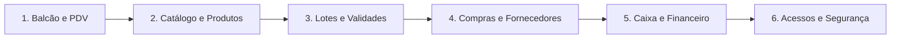

# Roteiro Estruturado de Entrevista Presencial & Homologação de Usabilidade
## Projeto MrStock ERP v2.2.0 • Papelaria Real
**Instituição:** ETEC Fernando Prestes — Centro Paula Souza  
**Equipe Mr. Coding:** Douglas Moraes Braz • Cesar Augusto • Eduardo Sugahara • Enzo Soares • Nikolas Pires  
**Público-Alvo da Entrevista:** Proprietária e Operadora Principal da Papelaria Real  
**Local:** Balcão de Atendimento / Caixa da Papelaria Real (Sorocaba – SP)  
**Data Prevista:** Setembro de 2026  

---

## 1. Protocolo de Condução e Divisão de Papéis da Equipe

Para garantir que a visita seja altamente profissional, ágil e não atrapalhe a rotina de vendas da loja, a equipe deve operar de forma sincronizada:

| Membro | Função na Sessão | Atribuição Prática |
| :--- | :--- | :--- |
| **Cesar Augusto** | **Condutor da Entrevista** | Conduz a conversa com a dona, dita o ritmo, faz as perguntas e agradece cordialmente. |
| **Eduardo Sugahara** | **Apresentador do Sistema** | Opera o notebook com o ERP aberto (`https://mrstock.com.br/`), demonstra cada fluxo na prática na frente da cliente. |
| **Douglas Braz** | **Diretor Técnico & Arquitetura** | Esclarece dúvidas técnicas imediatas, avalia a viabilidade das solicitações e anota impactos no código. |
| **Nikolas Pires** | **Anotador de Regras de Negócio & DER** | Anota detalhadamente as regras de banco de dados, tributação, prazos e fornecedores citados. |
| **Enzo Soares** | **Registrador de Evidências & QTS** | Registra fotos da visita (com permissão), anota as respostas da escala de usabilidade para compor o TCC. |

> [!IMPORTANT]
> **Regra de Ouro da Visita:** Não tentar "vender" o sistema nem justificar decisões de desenvolvimento caso ela aponte uma dificuldade. O objetivo é **ouvir ativamente**, observar reações espontâneas e identificar onde a vida dela pode ser facilitada.

---

## 2. Etapa 1: Abertura e Contextualização (2 a 3 minutos)

**Fala sugerida para o Cesar:**
> *"Olá, [Nome da Proprietária]! Muito obrigado por nos receber. Como você acompanhou, desenvolvemos o MrStock ERP pensando especificamente nos desafios reais do dia a dia aqui da Papelaria Real. Hoje o sistema está 100% pronto e funcionando na nuvem. Viemos aqui não apenas para demonstrar, mas principalmente para colocar você e sua equipe como avaliadores. Queremos saber o que está perfeito, o que está sobrando e o que você gostaria que fosse mais simples ou diferente antes de fecharmos a versão final."*

---

## 3. Etapa 2: Demonstração Guiada & Bateria de Perguntas Críticas

Abaixo estão as **questões que mais geram dúvidas de engenharia e trade-offs operacionais**, organizadas por módulo do sistema:

---

### Bateria A: Frente de Caixa (PDV) e Atendimento de Balcão
*Objetivo: Descobrir como o caixa opera nos momentos de maior tensão (Volta às Aulas e picos).*

1. **Agilidade de Entrada do Item:**
   - *Pergunta:* "No seu dia a dia, a maioria das vendas é feita passando o leitor de código de barras físico, digitando o nome do produto ou clicando na categoria? O que é mais rápido quando a fila está grande?"
   - *Foco de Dúvida:* O sistema hoje prioriza bipagem ótica com leitor e atalhos de teclado (F1 a F9). Ela prefere usar o teclado ou prefere usar o mouse/toque na tela?
   - [ ] Resposta da Cliente: __________________________________________________

2. **Feedback Sonoro (Bip de 880Hz):**
   - *Pergunta:* "O sistema emite um bip sonoro ao reconhecer o produto, confirmando que ele entrou no carrinho sem precisar olhar para o monitor. No balcão barulhento, esse som ajuda a ter certeza de que o item passou ou prefere uma opção de silenciar?"
   - [ ] Resposta da Cliente: __________________________________________________

3. **Política de Descontos e Acréscimos:**
   - *Pergunta:* "Quando um cliente pede desconto (ex: pagamento à vista ou compra de lista de material escolar completa), como vocês aplicam? Você costuma dar uma porcentagem (ex: 5% no total), um valor fixo em dinheiro (ex: tirar R$ 5,00) ou arredondar o troco?"
   - *Foco de Dúvida:* Hoje o PDV possui campo de desconto em R$. Precisamos saber se ela sente falta de um botão de porcentagem direta (ex: `[-5%]`, `[-10%]`).
   - [ ] Resposta da Cliente: __________________________________________________

4. **Identificação do Cliente no Balcão:**
   - *Pergunta:* "Na maioria das vendas do dia a dia, você precisa cadastrar o nome e CPF do cliente na hora, ou 90% das compras são anônimas de 'Consumidor Final'?"
   - [ ] Resposta da Cliente: __________________________________________________

---

### Bateria B: Catálogo de Produtos e Peculiaridades de Papelaria
*Objetivo: Validar o formato dos produtos, etiquetas e a ausência deliberada de fotos.*

1. **Decisão Arquitetural: Sistema Limpo Sem Fotos de Produtos:**
   - *Pergunta:* "Nosso sistema propositalmente não usa fotos para cada caneta ou caderno. O objetivo disso foi fazer a tela carregar instantaneamente, sem travar nem pesar no computador do caixa. Você sente falta de ver a fotinho do produto na tela, ou concorda que ver apenas o nome, código e preço deixa a operação muito mais rápida?"
   - [ ] Resposta da Cliente: __________________________________________________

2. **Venda a Granel / Produtos Fracionados:**
   - *Pergunta:* "Na Papelaria Real vocês vendem itens fracionados por metro ou folha avulsa (por exemplo: plástico contact por metro, papel kraft por metro, fitas ou EVA), ou absolutamente tudo é vendido por unidade, pacote fechado ou caixa?"
   - *Foco de Dúvida:* Hoje o sistema trabalha com quantidades inteiras. Se houver venda por metro/metro linear (ex: 1,5m), teremos que habilitar decimais na quantidade do carrinho.
   - [ ] Resposta da Cliente: __________________________________________________

3. **Etiquetagem e Produtos Sem Código de Fábrica:**
   - *Pergunta:* "Muitos itens pequenos chegam sem código de barras (canetas soltas, borrachas avulsas, cartolinas). O gerador de etiquetas que criamos imprime códigos de barras em folhas comuns A4. Você costuma colar etiquetas de código de barras nos produtos da loja? Qual o tamanho ou papel que você usa?"
   - [ ] Resposta da Cliente: __________________________________________________

---

### Bateria C: Gestão de Lotes, Validades e Shelf-Life
*Objetivo: Definir se a rastreabilidade de validade deve ser opcional ou obrigatória.*

1. **Itens Perecíveis vs. Itens Não Perecíveis:**
   - *Pergunta:* "Implementamos um controle avançado de validade que avisa no painel quando um lote vai vencer em 30 dias (para produtos como tintas guache, colas líquidas, massinhas de modelar e corretivos). Para cadernos e pastas, isso obviamente não vence. No cadastro de novos produtos, você prefere que a data de validade seja um campo **totalmente opcional** (preenche só se o produto estragar) ou você quer ter que cadastrar lote para tudo?"
   - [ ] Resposta da Cliente: __________________________________________________

2. **Ação com Lotes Próximos do Vencimento:**
   - *Pergunta:* "Quando um produto está para vencer em 30 dias, o que você costuma fazer na loja? Colocar em promoção no balcão, devolver para o fornecedor ou descartar?"
   - [ ] Resposta da Cliente: __________________________________________________

---

### Bateria D: Compras, Fornecedores e Entrada de Estoque
*Objetivo: Mapear o processo de reposição de estoque com distribuidores.*

1. **Entrada de Mercadorias:**
   - *Pergunta:* "Quando chegam as caixas de mercadorias dos fornecedores (como Tilibra, Faber-Castell, Chamex), como vocês dão entrada no estoque hoje? Vocês digitam item por item ou sonham em apenas subir o arquivo XML da Nota Fiscal para que os produtos entrem sozinhos?"
   - *Foco de Dúvida:* A importação de XML de NF-e de compra pode ser o grande destaque no roadmap v3.0 / Trabalhos Futuros do TCC.
   - [ ] Resposta da Cliente: __________________________________________________

2. **Conferência Física de Mercadorias:**
   - *Pergunta:* "O sistema gera uma folha de 'Espelho de Conferência de Compra' que pode ser impressa para quem descarrega as caixas ir marcando com caneta o que chegou. Isso é útil para o seu almoxarifado/depósito?"
   - [ ] Resposta da Cliente: __________________________________________________

---

### Bateria E: Gestão Financeira, Fiado e Fechamento de Caixa
*Objetivo: Validar regras de fluxo de caixa e práticas tradicionais do comércio de bairro.*

1. **Venda a Prazo ("Caderninho" / Fiado / Convênio Escolar):**
   - *Pergunta:* "Na papelaria vocês vendem 'fiado' ou com 'anotação no caderninho' para escolas, empresas parceiras ou clientes antigos pagarem no fim do mês? Ou todo cliente paga na hora via Pix, Dinheiro ou Cartão?"
   - *Foco de Dúvida:* Se ela fizer fiado, precisamos entender como ela controla isso hoje para avaliar se cabe incluir um módulo de Contas a Receber / Fiado na versão 3.0.
   - [ ] Resposta da Cliente: __________________________________________________

2. **Rotina de Fechamento de Caixa:**
   - *Pergunta:* "Como é feito o fechamento de caixa no fim do expediente? O funcionário conta as notas da gaveta e você confere no sistema se o valor bateu ('Fechamento Cego'), ou ele mesmo vê o total vendido no sistema?"
   - [ ] Resposta da Cliente: __________________________________________________

3. **Retiradas de Dinheiro no Meio do Dia (Sangrias):**
   - *Pergunta:* "Vocês costumam tirar dinheiro da gaveta durante o dia para pagar um fornecedor na porta, comprar marmita ou transporte (a chamada 'Sangria')?"
   - [ ] Resposta da Cliente: __________________________________________________

---

### Bateria F: Perfis de Acesso e Sigilo de Informações (RBAC)
*Objetivo: Validar se a separação entre Administrador e Caixa atende as necessidades de segurança.*

1. **Sigilo de Margem de Lucro e Custos:**
   - *Pergunta:* "No MrStock ERP, nós blindamos o acesso: o funcionário do caixa só consegue bipar e vender; ele **não consegue ver quanto você pagou pelo produto, quanto a papelaria teve de lucro, nem relatórios financeiros**. Você aprova essa divisão de sigilo ou gostaria que o caixa tivesse acesso a mais alguma coisa?"
   - [ ] Resposta da Cliente: __________________________________________________

2. **Cancelamento de Vendas:**
   - *Pergunta:* "Se o operador de caixa errar e precisar cancelar uma venda passada, você prefere que ele possa cancelar sozinho ou que exija a senha da dona/gerente para estornar?"
   - [ ] Resposta da Cliente: __________________________________________________

---

## 4. Etapa 3: Avaliação Rápida de Usabilidade (Escala SUS Simplificada)

Ao final da demonstração, peça para a proprietária dar uma nota de **1 a 5** para as afirmações abaixo (onde **1 = Discordo Totalmente** e **5 = Concordo Totalmente**):

| # | Afirmação Avaliada | 1 | 2 | 3 | 4 | 5 | Observações da Cliente |
| :-: | :--- | :-: | :-: | :-: | :-: | :-: | :--- |
| **01** | *Achei o visual do sistema limpo, profissional e fácil de entender.* | [ ] | [ ] | [ ] | [ ] | [ ] | |
| **02** | *A tela de vendas (PDV) é rápida o suficiente para a hora do rush.* | [ ] | [ ] | [ ] | [ ] | [ ] | |
| **03** | *Achei as cores e botões bem destacados (fácil saber onde clicar).* | [ ] | [ ] | [ ] | [ ] | [ ] | |
| **04** | *O cálculo de troco automático facilita a rotina e evita erros humanos.* | [ ] | [ ] | [ ] | [ ] | [ ] | |
| **05** | *A busca de produtos na hora da venda responde de forma instantânea.* | [ ] | [ ] | [ ] | [ ] | [ ] | |
| **06** | *Os relatórios e gráficos mostram exatamente o que eu preciso saber sobre o negócio.* | [ ] | [ ] | [ ] | [ ] | [ ] | |
| **07** | *Eu me sentiria confiante em usar esse sistema na Papelaria Real no lugar do método atual.* | [ ] | [ ] | [ ] | [ ] | [ ] | |

---

## 5. Etapa 4: Coleta Aberta de Demandas ("Wishlist" da Cliente)

Perguntas finais abertas para captar impressões sinceras:

1. **O que mais te chamou a atenção positivamente no MrStock ERP?**  
   *Anotação:* ____________________________________________________________________  
   ________________________________________________________________________________

2. **Existe alguma coisa que você achou complicada ou que preferiria ver mais simples?**  
   *Anotação:* ____________________________________________________________________  
   ________________________________________________________________________________

3. **Se você pudesse pedir uma funcionalidade dos seus sonhos que hoje você não tem, qual seria?**  
   *Anotação:* ____________________________________________________________________  
   ________________________________________________________________________________

4. **Qual impressora térmica de cupom você tem na loja atualmente (marca/modelo)?**  
   *Anotação:* ____________________________________________________________________  

---

## 6. Etapa 5: Fechamento e Próximos Passos
- Agradecimento caloroso à proprietária pelo tempo dedicado.
- Foto oficial da equipe com a cliente no balcão da papelaria (essencial para a documentação e apresentação na banca da ETEC).
- Compromisso de entregar o **Manual de Operação Ilustrado** na próxima etapa.
