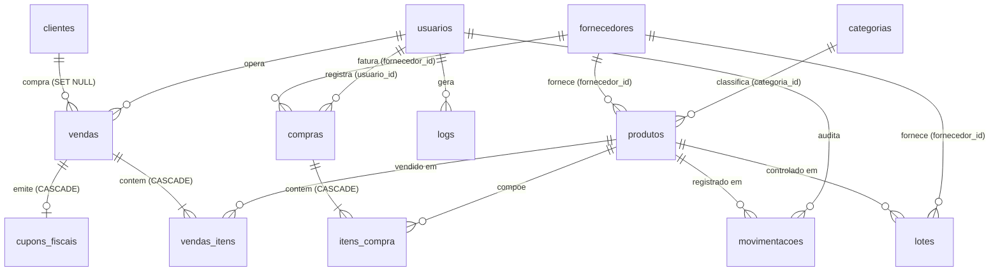

# Banco de Dados & Dicionário de Dados — MrStock ERP v2.0

**SGBD:** MySQL 8.0+ / MariaDB 10.4+  
**Nome da Base:** `mrstock_db`  
**Engine:** InnoDB  
**Charset / Collation:** `utf8mb4` / `utf8mb4_general_ci`  
**Integridade Referencial:** Ativa (Foreign Keys com `CASCADE` e `SET NULL`)

---

## 1. Diagrama Entidade-Relacionamento (DER)

---

## 2. Dicionário de Dados das 12 Tabelas Oficiais + Lotes

### 👤 1. `usuarios` (Autenticação e Perfis)
| Campo | Tipo | Nulo | Chave | Descrição |
| :--- | :--- | :---: | :---: | :--- |
| `id` | INT(11) | NÃO | PK (AI) | Identificador único do operador |
| `username` | VARCHAR(50) | NÃO | UNIQUE | Nome de login de acesso |
| `password` | VARCHAR(255) | NÃO | | Hash da senha gerado com Bcrypt |
| `perfil` | ENUM('admin','caixa') | SIM | | Nível de acesso RBAC |

---

### 📂 2. `categorias` (Classificação de Produtos)
| Campo | Tipo | Nulo | Chave | Descrição |
| :--- | :--- | :---: | :---: | :--- |
| `id` | INT(11) | NÃO | PK (AI) | Identificador da categoria |
| `nome` | VARCHAR(100) | NÃO | | Nome da categoria mercadológica |
| `descricao` | TEXT | SIM | | Descrição e escopo da categoria |

---

### 🚚 3. `fornecedores` (Parceiros e Distribuidores)
| Campo | Tipo | Nulo | Chave | Descrição |
| :--- | :--- | :---: | :---: | :--- |
| `id` | INT(11) | NÃO | PK (AI) | Identificador do fornecedor |
| `nome` | VARCHAR(255) | NÃO | | Razão Social / Nome Fantasia |
| `cnpj` | VARCHAR(20) | SIM | | CNPJ formatado |
| `telefone` | VARCHAR(20) | SIM | | Telefone para contato |
| `email` | VARCHAR(255) | SIM | | E-mail de cotação |
| `status` | ENUM('ativo','inativo') | SIM | | Status cadastral |

---

### 👥 4. `clientes` (Cadastro de Consumidores)
| Campo | Tipo | Nulo | Chave | Descrição |
| :--- | :--- | :---: | :---: | :--- |
| `id` | INT(11) | NÃO | PK (AI) | Identificador do cliente |
| `nome` | VARCHAR(255) | NÃO | | Nome completo ou razão social |
| `cpf_cnpj` | VARCHAR(18) | SIM | | Documento de identificação |
| `telefone` | VARCHAR(20) | SIM | | WhatsApp para contato |
| `email` | VARCHAR(255) | SIM | | E-mail para envio de comprovantes |
| `status` | ENUM('ativo','inativo') | SIM | | Status do cliente |
| `data_cadastro` | DATETIME | SIM | | Data de inclusão no sistema |

---

### 📦 5. `produtos` (Catálogo e Inventário)
| Campo | Tipo | Nulo | Chave | Descrição |
| :--- | :--- | :---: | :---: | :--- |
| `id` | INT(11) | NÃO | PK (AI) | Identificador do produto |
| `nome` | VARCHAR(255) | NÃO | | Descrição comercial do item |
| `codigo_de_barra` | VARCHAR(50) | SIM | INDEX | Código EAN-13 ou Code-128 |
| `categoria_id` | INT(11) | SIM | FK | Vínculo com categorias (`ON DELETE SET NULL`) |
| `fornecedor_id` | INT(11) | SIM | FK | Vínculo com fornecedores (`ON DELETE SET NULL`) |
| `preco_compra` | DECIMAL(10,2) | NÃO | | Preço de custo de aquisição |
| `preco_venda` | DECIMAL(10,2) | NÃO | | Preço de venda ao consumidor |
| `quantidade` | INT(11) | SIM | | Saldo físico atual em estoque |
| `estoque_minimo` | INT(11) | SIM | | Ponto de pedido para alertas |
| `validade` | DATE | SIM | | Data de validade para itens perecíveis |
| `status` | ENUM('ativo','inativo') | SIM | | Status de disponibilidade de venda |

---

### 🛒 6. `compras` (Ordens de Compra e Entradas)
| Campo | Tipo | Nulo | Chave | Descrição |
| :--- | :--- | :---: | :---: | :--- |
| `id` | INT(11) | NÃO | PK (AI) | Identificador do pedido de compra |
| `fornecedor_id` | INT(11) | NÃO | FK | Fornecedor faturado |
| `usuario_id` | INT(11) | NÃO | FK | Usuário administrador que lançou |
| `numero_nota` | VARCHAR(50) | SIM | | Número da Nota Fiscal de entrada |
| `valor_total` | DECIMAL(10,2) | NÃO | | Valor global da compra |
| `tipo_pagamento`| VARCHAR(50) | SIM | | Forma de pagamento (Boleto, PIX, etc.) |
| `status` | ENUM('PENDENTE','PAGA','CANCELADA') | SIM | | Status financeiro da ordem |
| `data_compra` | DATETIME | SIM | | Data/hora do lançamento |

---

### 📑 7. `itens_compra` (Itens Faturados na Compra)
| Campo | Tipo | Nulo | Chave | Descrição |
| :--- | :--- | :---: | :---: | :--- |
| `id` | INT(11) | NÃO | PK (AI) | Identificador do item de compra |
| `compra_id` | INT(11) | NÃO | FK | Vínculo com compras (`ON DELETE CASCADE`) |
| `produto_id` | INT(11) | NÃO | FK | Vínculo com o produto adquirido |
| `quantidade` | DECIMAL(10,3) | NÃO | | Quantidade recebida |
| `preco_unitario`| DECIMAL(10,2) | NÃO | | Preço de custo unitário |
| `subtotal` | DECIMAL(10,2) | NÃO | | Quantidade $\times$ Preço Unitário |

---

### 💳 8. `vendas` (Transações Comerciais do PDV)
| Campo | Tipo | Nulo | Chave | Descrição |
| :--- | :--- | :---: | :---: | :--- |
| `id` | INT(11) | NÃO | PK (AI) | Número da venda / Cupom |
| `cliente_id` | INT(11) | SIM | FK | Cliente comprador (`ON DELETE SET NULL`) |
| `total` | DECIMAL(10,2) | NÃO | | Valor final liquidado |
| `forma_pagamento`| VARCHAR(50) | NÃO | | DINHEIRO, PIX, CARTÃO DE CRÉDITO, etc. |
| `data_venda` | DATETIME | SIM | INDEX | Data e hora exata da transação |

---

### 🛍️ 9. `vendas_itens` (Itens Baixados na Venda)
| Campo | Tipo | Nulo | Chave | Descrição |
| :--- | :--- | :---: | :---: | :--- |
| `id` | INT(11) | NÃO | PK (AI) | Identificador do item vendido |
| `venda_id` | INT(11) | NÃO | FK | Vínculo com a venda (`ON DELETE CASCADE`) |
| `produto_id` | INT(11) | NÃO | FK | Vínculo com o produto |
| `quantidade` | INT(11) | NÃO | | Quantidade baixada |
| `preco_unitario`| DECIMAL(10,2) | NÃO | | Preço oficial praticado na venda |

---

### 📈 10. `movimentacoes` (Livro-Razão de Auditoria)
| Campo | Tipo | Nulo | Chave | Descrição |
| :--- | :--- | :---: | :---: | :--- |
| `id` | INT(11) | NÃO | PK (AI) | Identificador do movimento |
| `produto_id` | INT(11) | NÃO | FK | Produto movimentado (`ON DELETE CASCADE`) |
| `tipo` | ENUM('entrada_compra','saida_venda','devolucao_cliente','devolucao_fornecedor','perda') | NÃO | | Motivo do fluxo |
| `quantidade` | INT(11) | NÃO | | Quantidade alterada |
| `data_movimento`| DATETIME | SIM | INDEX | Carimbo de data/hora |
| `observacao` | VARCHAR(255) | SIM | | Detalhes e número do documento associado |

---

### 🖨️ 11. `cupons_fiscais` (Espelhos Fiscais)
| Campo | Tipo | Nulo | Chave | Descrição |
| :--- | :--- | :---: | :---: | :--- |
| `id` | INT(11) | NÃO | PK (AI) | Identificador do cupom |
| `venda_id` | INT(11) | NÃO | FK | Vínculo com a venda (`ON DELETE CASCADE`) |
| `chave_acesso` | VARCHAR(44) | NÃO | UNIQUE | Chave de segurança formatada |
| `data_emissao` | DATETIME | SIM | | Data e hora de emissão |

---

### 📝 12. `logs` (Trilha de Auditoria de Sistema)
| Campo | Tipo | Nulo | Chave | Descrição |
| :--- | :--- | :---: | :---: | :--- |
| `id` | INT(11) | NÃO | PK (AI) | Identificador do log |
| `usuario_id` | INT(11) | NÃO | FK | Operador que realizou a ação |
| `acao` | VARCHAR(100) | NÃO | | Tipo da ação (LOGIN, INSERT, UPDATE) |
| `descricao` | TEXT | SIM | | Detalhamento do evento |
| `tabela_afetada`| VARCHAR(100) | SIM | | Entidade modificada |
| `ip_usuario` | VARCHAR(45) | SIM | | Endereço IP do cliente |
| `data_log` | DATETIME | SIM | | Carimbo temporal do evento |

---

### 🏷️ 13. `lotes` (Controle Auxiliar de Lotes e Validades)
| Campo | Tipo | Nulo | Chave | Descrição |
| :--- | :--- | :---: | :---: | :--- |
| `id` | INT(11) | NÃO | PK (AI) | Identificador do lote |
| `produto_id` | INT(11) | NÃO | FK | Vínculo com produto (`ON DELETE CASCADE`) |
| `numero_lote` | VARCHAR(50) | NÃO | | Código impresso na embalagem |
| `data_validade`| DATE | NÃO | | Data limite de uso |
| `quantidade` | INT(11) | NÃO | | Saldo disponível do lote |
| `preco_compra` | DECIMAL(10,2) | NÃO | | Custo do lote específico |