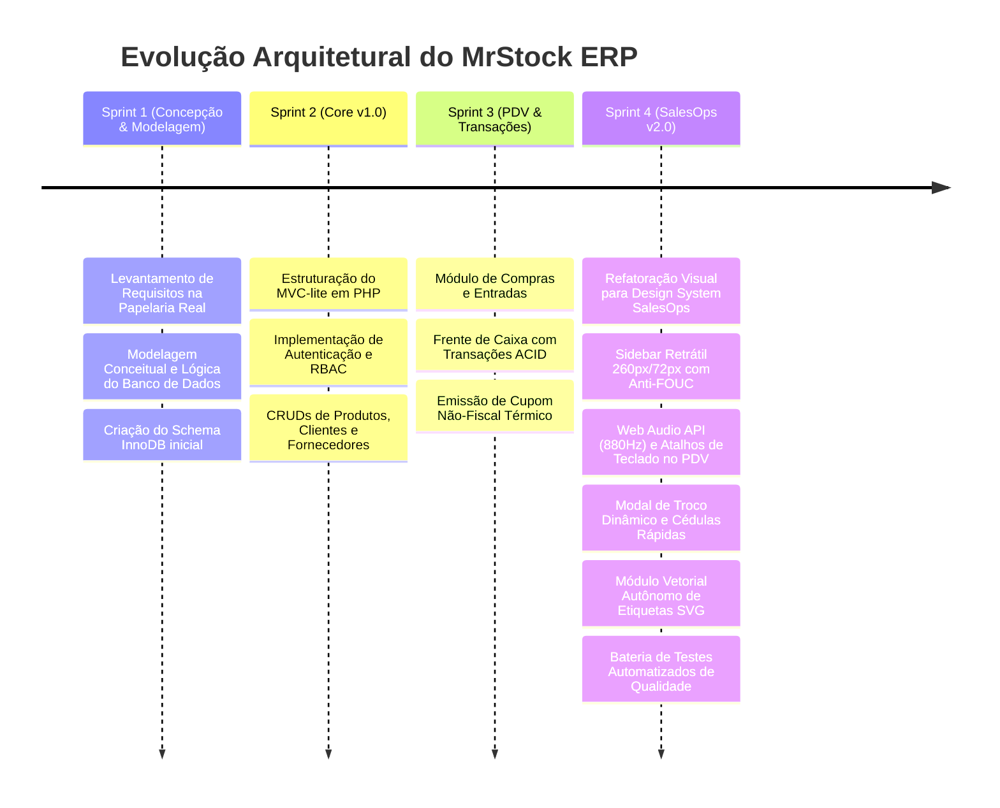

# Diário de Desenvolvimento & Histórico de Versões — MrStock ERP

Este documento registra a linha do tempo, sprints de engenharia e a evolução arquitetural do **MrStock ERP** desde a concepção inicial até a homologação da **Versão 2.0 (SalesOps Edition)**.

---

## 🗓️ Linha do Tempo e Marcos do Projeto

---

## 📋 Detalhamento dos Sprints de Desenvolvimento

### Sprint 1: Fundação & Modelagem (Maio/2026)
- Visita técnica e levantamento de necessidades na Papelaria Real.
- Definição do escopo do TCC e aprovação da proposta pelos orientadores.
- Criação das 12 tabelas InnoDB relacionais com integridade referencial.

### Sprint 2: Lançamento da Versão 1.0 (Junho/2026)
- Criação do singleton de conexão PDO em `inc/database.php`.
- Implementação de autenticação com Bcrypt e isolamento de rotas em `inc/auth.php`.
- Desenvolvimento dos CRUDs de produtos, categorias, clientes e fornecedores.

### Sprint 3: Fechamento Transacional & Relatórios (Julho/2026)
- Criação do módulo de compras com cálculo automático de estoque.
- Implementação do PDV com bloqueio pessimista (`SELECT ... FOR UPDATE`).
- Geração de relatórios PDF e exportação para planilhas Excel em 9 colunas.

### Sprint 4: Versão 2.0 SalesOps Edition & Homologação (Agosto/2026)
- **Ergonomia do PDV:** Atalhos de teclado globais (`F2`-`F9`, `ESC`) e sintetizador sonoro de 880Hz via Web Audio API.
- **Troco Dinâmico:** Teclado numérico e botões de cédula de R$ 10 a R$ 200.
- **Etiquetas Vetoriais:** Geração autônoma de SVG Code-128 e EAN-13 em `inc/barcode_helper.php`.
- **Design System SalesOps:** Sidebar com script Anti-FOUC no `<head>`, popover com `z-index: 99999` e paginação institucional verde.
- **Auditoria de QA:** Bateria de testes de conformidade cobrindo Segurança (RBAC/CSRF), Integridade ACID, UI/UX e Compatibilidade PHP 8.2.