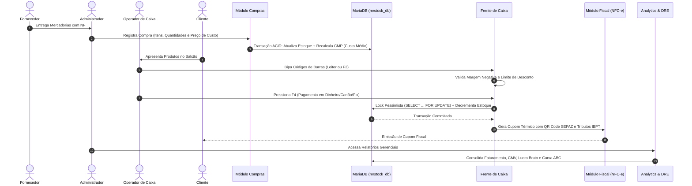
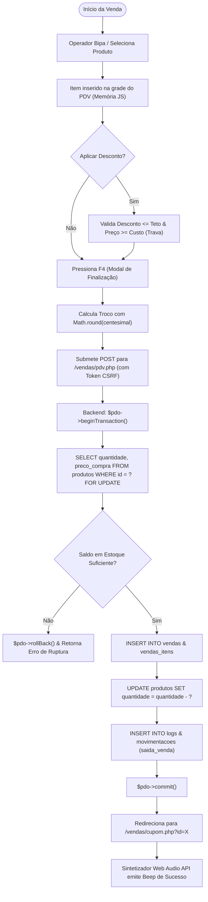

# 🔄 Fluxos Operacionais e Ciclo de Vida do Sistema

Os diagramas abaixo ilustram a esteira completa de processamento de dados no MrStock ERP v2.1.0:

---

## 1. Ciclo de Vida Comercial Integrado (Entrada ➔ PDV ➔ BI)

---

## 2. Fluxo Transacional do Checkout no PDV (Concorrência & ACID)

