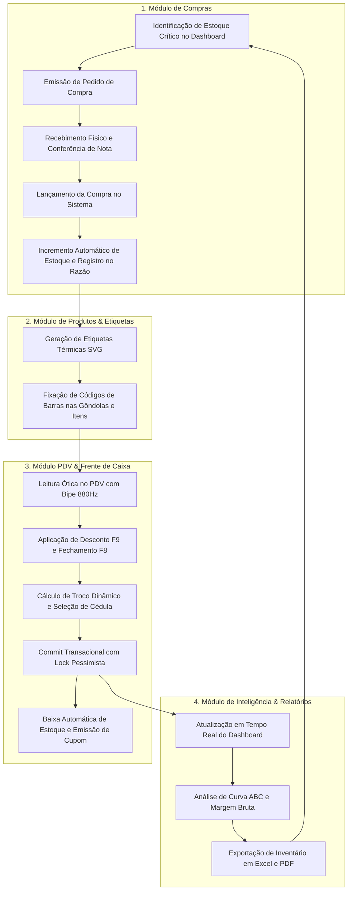
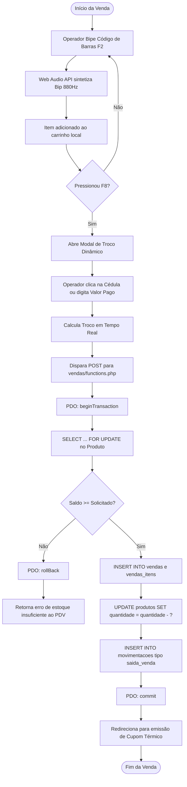

# Fluxos de Processo & Arquitetura do Sistema — MrStock ERP v2.0

Este documento apresenta os fluxogramas e diagramas de sequência dos processos de negócio fundamentais da Papelaria Real no **MrStock ERP**.

---

## 1. Macrofluxo Integrado do ERP

---

## 2. Fluxo Detalhado do PDV com Bloqueio Pessimista

