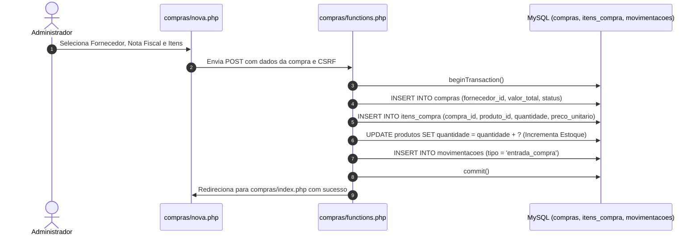

# Módulo de Gestão de Compras & Abastecimento

**Arquivos:** `compras/index.php`, `compras/nova.php`, `compras/visualizar.php`, `compras/functions.php`  
**Acesso:** Exclusivo para Administradores (`admin`)  
**Objetivo:** Gerenciar pedidos de compras junto a fornecedores e distribuidores (Tilibra, Bic, Acrilex), dar entrada automatizada de mercadorias no estoque e controlar contas a pagar.

---

## 1. Visão Geral do Fluxo de Compras

---

## 2. Telas do Módulo

### 📋 2.1 Listagem de Compras (`compras/index.php`)
- Tabela com Live Search, data da compra, fornecedor, número de nota, valor total e status (`PENDENTE` / `PAGA`).
- Menu de ações com atalho para **Visualizar Pedido** e **Alternar Status de Pagamento**.

### ➕ 2.2 Nova Compra (`compras/nova.php`)
- Seleção dinâmica de fornecedor com preenchimento automático.
- Adição dinâmica de múltiplos produtos no carrinho de compras.
- Cálculo automático de subtotais e valor global da ordem de compra.

### 👁️ 2.3 Visualização de Pedido Master-Detail (`compras/visualizar.php`)
- Espelho formal da ordem de compra com dados completos do distribuidor.
- Listagem dos itens comprados, quantidades e custos unitários.
- Botão de impressão formatado para auditoria física no recebimento de mercadorias no depósito.