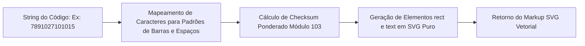

# Módulo de Impressão de Etiquetas & Código de Barras SVG

**Arquivos:** `produtos/etiquetas.php`, `inc/barcode_helper.php`  
**Acesso:** Exclusivo para Administradores (`admin`)  
**Objetivo:** Permitir a geração e impressão de etiquetas térmicas e folhas A4 com códigos de barras vetoriais, preços e nomes de produtos de forma autônoma e 100% offline.

---

## 1. Visão Geral

O **Módulo de Etiquetas** soluciona uma das maiores dores operacionais da **Papelaria Real**: a necessidade de identificar gôndolas, caixas fechadas e itens fracionados com códigos de barras legíveis por qualquer scanner ótico USB ou sem fio.

O módulo não depende de APIs externas da web (como Google Charts ou QuickChart) e não requer extensões complexas de imagens no PHP (como GD ou Imagick), gerando o código de barras diretamente em código vetorial **SVG nativo**.

---

## 2. O Algoritmo Vetorial SVG (`inc/barcode_helper.php`)

O arquivo `inc/barcode_helper.php` implementa a função `gerarBarcodeSVG($code, $width, $height, $showText)` baseada na norma do padrão **Code-128 (Subconjunto B)** e **EAN-13**:



### 💎 Vantagens da Geração em SVG Puro:
1. **Nitidez Infinita:** Sendo vetorial, o código de barras pode ser escalado para etiquetas pequenas (30x20mm) ou cartazes de gôndola sem qualquer pixelamento.
2. **Alta Velocidade de Renderização:** Processamento em milissegundos direto no fluxo de saída do PHP.
3. **Leitura Instantânea:** As bordas pretas e brancas possuem precisão matemática exata, garantindo taxa de leitura de 100% no leitor ótico do PDV.

---

## 3. Funcionalidades da Interface (`produtos/etiquetas.php`)

### 📋 3.1 Painel de Configuração e Filtros
- **Seleção por Categoria:** Permite filtrar os produtos que farão parte do lote de etiquetas (ex: apenas *Escolar* ou *Papelaria*).
- **Controle de Quantidade de Cópias:** Permite definir quantas etiquetas serão geradas por produto (ex: imprimir 10 etiquetas para uma caixa de canetas).
- **Exibição de Preço:** Opção de incluir ou ocultar o preço de venda na etiqueta (útil para etiquetas internas de estoque vs etiquetas de gôndola para clientes).
- **Tamanho da Etiqueta:**
  - Formato Gôndola / Térmica (50mm x 30mm)
  - Formato Folha A4 Padrão (Grid 3 colunas x 8 linhas)

---

### 🖨️ 3.2 Otimização para Impressão via CSS `@media print`

A página conta com regras de CSS dedicadas à impressão:

```css
@media print {
    /* Oculta Sidebar, Topbar, Filtros e Botões de Ação */
    .so-sidebar, .so-header, .no-print, .btn, .card-header {
        display: none !important;
    }
    
    /* Remove margens e bordas extras do navegador */
    body {
        background: #fff !important;
        margin: 0 !important;
        padding: 0 !important;
    }
    
    /* Grade de etiquetas com quebra de página automática */
    .label-sheet-grid {
        display: grid;
        grid-template-columns: repeat(3, 1fr);
        gap: 8px;
        page-break-inside: avoid;
    }
    
    .label-item {
        border: 1px dashed #ccc;
        padding: 8px;
        text-align: center;
        page-break-inside: avoid;
    }
}
```

---

## 4. Passo a Passo Operacional

1. No menu lateral, acesse **Produtos** $\rightarrow$ **Gerador de Etiquetas** (ou clique no atalho de etiquetas na tabela de produtos).
2. Selecione a **Categoria** desejada ou marque os produtos específicos.
3. Ajuste a **Quantidade de Cópias** de cada produto.
4. Escolha se deseja exibir o **Preço de Venda** e o **Nome Fantasia da Papelaria Real**.
5. Clique em **Visualizar Impressão**.
6. Pressione `Ctrl + P` (ou clique em **Imprimir Etiquetas**) para abrir o diálogo nativo do sistema operacional e enviar para a impressora térmica ou jato de tinta/laser.