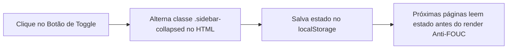

# Módulo de Navegação, Layout & Design System SalesOps

**Arquivos:** `inc/header.php`, `inc/footer.php`, `css/style.css`  
**Objetivo:** Prover uma interface ergonômica, responsiva, moderna e de alta densidade de informação para operação diária do ERP.

---

## 1. Visão Geral do Design System SalesOps

O layout do **MrStock ERP v2.0** adota o padrão *SalesOps*, inspirado em dashboards corporativos de alta performance. O objetivo é reduzir a fadiga visual do operador, maximizar a área útil da tela e fornecer respostas táteis e visuais imediatas para cada ação.

---

## 2. Componentes Estruturais

### 📐 2.1 Sidebar Retrátil com Persistência
- **Largura Expandida:** `260px` — Exibe os ícones FontAwesome e os rótulos de texto de cada menu.
- **Largura Colapsada:** `72px` — Oculta os textos e mantém apenas os ícones centralizados para ganho de espaço de visualização em tabelas densas.
- **Botão de Alternância:** Posicionado no topo da barra de navegação. Ao ser clicado, alterna a classe `.sidebar-collapsed` no elemento raiz (`<html>`).
- **Persistência em LocalStorage:** A preferência do operador é salva automaticamente via chave `mrstock_sidebar_collapsed`.



### ⚡ 2.2 Script Síncrono Anti-FOUC
Para impedir o efeito desagradável de tela piscando (*Flash of Unstyled Content*) ao navegar entre as páginas, um script inline ultra-rápido é executado no `<head>` de `inc/header.php` antes mesmo da montagem do DOM:

```html
<script>
    (function() {
        const collapsed = localStorage.getItem('mrstock_sidebar_collapsed');
        if (collapsed === 'true') {
            document.documentElement.classList.add('sidebar-collapsed');
        }
    })();
</script>
```

---

### 👤 2.3 Topbar & Popover de Usuário Soberano
- **Avatar Dinâmico:** Gera automaticamente as iniciais do operador baseado no perfil logado (`AD` para Administrador, `CX` para Caixa) com fundo colorido e tipografia destacada.
- **Popover Dropdown Soberano:**
  - Configurado com `z-index: 99999 !important` no CSS.
  - Garante que o menu do usuário nunca seja encoberto por cabeçalhos de tabelas fixos, modais do Bootstrap ou gráficos.
  - Contém informações do usuário logado, atalho de troca de senha e botão de encerramento seguro de sessão com destaque em vermelho.

---

### 📊 2.4 Tabelas Padronizadas (.so-table)
Todas as tabelas de listagem do sistema seguem uma estrutura padrão:
1. **Cabeçalho Escuro:** Fundo em `#222d31` com texto branco de alto contraste.
2. **Hover Suave:** Efeito de destaque na linha sob o cursor do mouse (`#f8fafc`).
3. **Menu Flutuante de 3 Pontos (`.so-actions-btn`):**
   - Substitui múltiplos botões largos de ação por um único botão circular compacto `⋮`.
   - Ao ser clicado, abre um dropdown com opções semânticas (Ex: *Editar*, *Detalhes*, *Histórico*, *Excluir*).
4. **Live Search Instantâneo (`.so-search-box`):**
   - Campo de busca em tempo real com ícone de lupa.
   - Filtra as linhas visíveis da tabela via JavaScript sem recarregar a página.

---

### 🟢 2.5 Paginação Institucional Verde
- Substitui a paginação azul padrão do Bootstrap pela paleta verde institucional:
  - Botão ativo: Fundo `#284936`, borda `#284936` e texto branco.
  - Hover de página: Fundo `#6ae49b` suave com texto `#1a2421`.
  - Wrapper com espaçamento superior e inferior padronizado para garantir respiro visual.

---

## 3. Paleta de Cores do Design System

| Variável CSS | Código Hex | Aplicação no Sistema |
| :--- | :---: | :--- |
| `--mr-bg-primary` | `#284936` | Botões principais, paginação ativa, headers de destaque |
| `--mr-bg-dark` | `#222d31` | Fundo da Sidebar e cabeçalhos de tabelas |
| `--mr-bg-deep` | `#1a2421` | Estado ativo de links na sidebar e contrastes profundos |
| `--mr-accent` | `#6ae49b` | Badges de sucesso, destaques de hover, foco do leitor no PDV |
| `--mr-border` | `#e2e8f0` | Divisórias e bordas sutis de cards |
| `--mr-text-muted` | `#64748b` | Subtítulos e instruções secundárias |