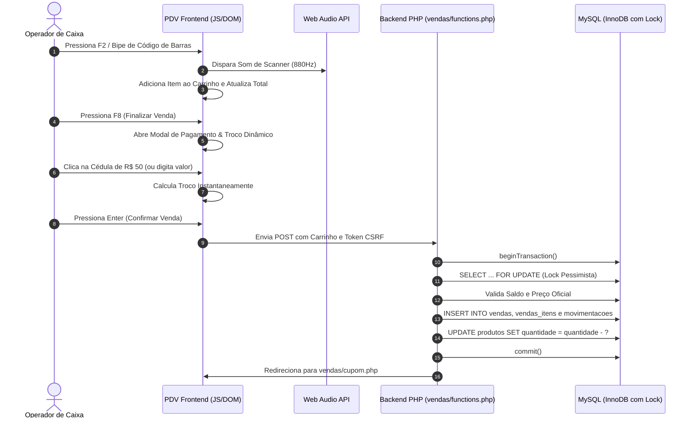

# Módulo de Ponto de Venda (PDV / Frente de Caixa)

**Arquivos:** `vendas/pdv.php`, `vendas/functions.php`, `vendas/cupom.php`  
**Acesso:** Operadores de Caixa (`caixa`) e Administradores (`admin`)  
**Objetivo:** Permitir a realização de vendas rápidas no balcão da Papelaria Real, com alta velocidade de digitação, suporte total a leitores de código de barras, feedback acústico em tempo real e cálculo instantâneo de troco.

---

## 1. Visão Geral da Frente de Caixa SalesOps

O PDV do **MrStock ERP v2.0** foi reformulado com foco na redução de atrito e velocidade no atendimento:
- O operador pode realizar uma venda completa **sem tocar no mouse**, utilizando apenas o teclado e o leitor ótico.
- Cada bip no scanner ótico produz um som senoidal agradável em **880Hz** via Web Audio API.
- O fechamento da compra oferece botões de cédulas rápidas que calculam o troco instantaneamente.



---

## 2. Mapa de Atalhos Globais de Teclado

O PDV implementa um listener global no JavaScript que intercepta teclas de função sem conflitar com o navegador:

| Tecla de Atalho | Ação Executada no PDV |
| :---: | :--- |
| **`F2`** | **Bipe / Busca Rápida:** Foca instantaneamente o cursor no input do leitor de código de barras. |
| **`F4`** | **Consultar Produtos:** Abre a consulta rápida do catálogo com saldos de estoque e preços. |
| **`F8`** | **Finalizar Venda:** Abre o Modal de Pagamento e Troco Dinâmico com foco no campo de valor pago. |
| **`F9`** | **Desconto / Acréscimo:** Permite aplicar descontos em percentual (%) ou reais (R$) na venda. |
| **`ESC`** | **Cancelar / Fechar:** Fecha qualquer modal ativo ou limpa o campo de código de barras. |
| **`+` / `-`** | **Ajustar Quantidade:** Aumenta ou diminui a quantidade do item selecionado no carrinho. |
| **`Delete`** | **Remover Item:** Exclui o produto selecionado do carrinho de compras. |

---

## 3. Modal de Pagamento & Troco Dinâmico

O modal acionado via `F8` inclui ferramentas avançadas para agilizar o cálculo financeiro do caixa:

### 💵 3.1 Botões de Cédula Rápida
Botões ergonômicos de clique rápido com as notas do Real:
- **R$ 10,00**
- **R$ 20,00**
- **R$ 50,00**
- **R$ 100,00**
- **R$ 200,00**
- **Valor Exato:** Preenche automaticamente o campo com o valor total da venda, zerando o troco.

### 🧮 3.2 Painel de Troco em Tempo Real
- Se `Valor Pago < Total`: Exibe alerta suave em amarelo indicando valor restante a pagar.
- Se `Valor Pago >= Total`: Exibe painel em verde esmeralda com o **Valor do Troco** em destaque gigante.

---

## 4. Segurança Transacional & Bloqueio Pessimista

Para garantir que o estoque nunca seja vendido em duplicidade no balcão, o controlador `vendas/functions.php` executa:

```php
$pdo->beginTransaction();
try {
    foreach ($cart as $item) {
        $produto_id = (int)$item['id'];
        $qtd_solicitada = (int)$item['qtd'];

        // Lock pessimista para evitar race condition
        $stmtChk = $pdo->prepare("SELECT id, nome, preco_venda, quantidade, status FROM produtos WHERE id = ? FOR UPDATE");
        $stmtChk->execute([$produto_id]);
        $prodInfo = $stmtChk->fetch();

        // Validação estrita de saldo real
        if (!$prodInfo || (int)$prodInfo['quantidade'] < $qtd_solicitada) {
            $pdo->rollBack();
            header("Location: " . BASE_URL . "/vendas/pdv.php?erro=estoque&produto=" . urlencode($prodInfo['nome'] ?? 'Item'));
            exit;
        }
        
        // O preço unitário é obtido estritamente do banco de dados (ignora manipulações no frontend)
        $precoOficial = (float)$prodInfo['preco_venda'];
        // ... insere itens e atualiza saldo
    }
    $pdo->commit();
} catch (Exception $e) {
    $pdo->rollBack();
    // Tratamento de erro
}
```

---

## 5. Emissão de Cupom Fiscal Não-Fiscal (`vendas/cupom.php`)

Após o commit da transação, o sistema gera o cupom formatado para bobinas térmicas de **80mm ou 58mm**:
- Dados da Papelaria Real (CNPJ, Endereço, Telefone).
- Itens detalhados com quantidade, preço unitário e subtotal.
- Forma de pagamento, valor recebido e troco calculado.
- **Hash de Integridade SHA-256** e data/hora com segundos.
- QR Code demonstrativo para consulta.
- Botão de impressão com disparo de `@media print` e atalho para retorno imediato ao PDV.