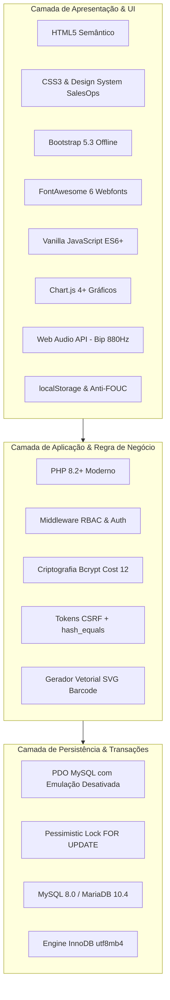

# Tecnologias Utilizadas — MrStock ERP v2.0

Este documento descreve detalhadamente a stack tecnológica adotada no **MrStock ERP**, as justificativas de escolha técnica e as inovações introduzidas na **Versão 2.0 (SalesOps Edition)**.

---

## 1. Visão Geral da Stack



---

## 2. Tecnologias de Backend & Segurança

### 🐘 PHP 8.2+
- **Justificativa:** Linguagem de ampla aceitação de mercado, excelente performance e baixo custo de infraestrutura.
- **Destaques na v2.0:**
  - Sintaxe moderna e tipagem rigorosa.
  - Eliminação total de recursos descontinuados (*zero warnings/deprecations*).
  - Padrão **Post-Redirect-Get (PRG)** em todos os formulários para impedir duplo envio em recargas acidentais (`F5`).

### 🛡️ Camada de Segurança e Criptografia
- **Bcrypt (`PASSWORD_BCRYPT`):** Hashing adaptativo com fator de custo elevado (`cost => 12`), tornando ataques de dicionário e força bruta computacionalmente inviáveis.
- **Proteção contra Injeção de SQL:** 100% das consultas ao banco utilizam *Prepared Statements* via PDO, com a diretiva `PDO::ATTR_EMULATE_PREPARES => false` forçada no driver.
- **Proteção CSRF (*Cross-Site Request Forgery*):** Tokens criptograficamente seguros gerados por `bin2hex(random_bytes(32))` e validados por comparação em tempo constante com `hash_equals()`.
- **Proteção XSS (*Cross-Site Scripting*):** Função utilitária `sanitize()` aplicando `htmlspecialchars($valor, ENT_QUOTES, 'UTF-8')` em todas as saídas de dados no DOM.
- **Hardening de Sessão e Cookies:**
  - `session.use_only_cookies = 1`
  - `session.use_strict_mode = 1`
  - Cookies emitidos com flags `HttpOnly` (inacessíveis via JavaScript) e `SameSite=Lax` (proteção em contextos de terceiros).
  - Regeneração do ID de sessão pós-login (`session_regenerate_id(true)`).

---

## 3. Tecnologias de Banco de Dados & Concorrência

### 🐬 MySQL 8.0+ / MariaDB (`InnoDB`)
- **Charset & Collation:** `utf8mb4` com `utf8mb4_general_ci`, oferecendo suporte a caracteres internacionais, acentuação e emojis sem corrupção.
- **Integridade Referencial:** Chaves estrangeiras com ações semânticas estritas:
  - `ON DELETE CASCADE` para relações dependentes (itens de venda/compra e cupons fiscais).
  - `ON DELETE SET NULL` para entidades de suporte (categorias e fornecedores em produtos).
- **Transações ACID:** Blocos `beginTransaction()`, `commit()` e `rollBack()` garantem que operações financeiras ou de estoque nunca fiquem em estado inconsistente.

### 🔒 Bloqueio Pessimista de Concorrência (*Pessimistic Locking*)
No fechamento de vendas (PDV) e baixa de estoque, o MrStock utiliza:
```sql
SELECT id, nome, preco_venda, quantidade, status FROM produtos WHERE id = ? FOR UPDATE
```
Essa cláusula bloqueia a linha do produto no nível do banco até o fim da transação, impedindo que dois caixas simultâneos vendam a mesma unidade física (*Race Condition*).

---

## 4. Tecnologias de Frontend & Ergonomia (SalesOps UI)

### 🎨 Design System SalesOps
- **Paleta Institucional:**
  - `--mr-bg-primary`: `#284936` (Verde Floresta Institucional)
  - `--mr-bg-dark`: `#222d31` (Cinza Grafite Escuro)
  - `--mr-bg-deep`: `#1a2421` (Background Escuro Profundo)
  - `--mr-accent`: `#6ae49b` (Verde Esmeralda de Destaque e Sucesso)
- **Tipografia:** Família tipográfica *Inter* embarcada localmente em formato `.woff2`.
- **Componentes:** Tabelas `.so-table`, cards de KPI `.so-card`, botões de ação flutuante `.so-actions-btn` e inputs `.so-search-box`.

### ⚡ Script Síncrono Anti-FOUC & Persistência Local
Para evitar que a tela pisque ou mude de largura após o carregamento (*Flash of Unstyled Content*), o `<head>` de `inc/header.php` executa um script inline síncrono que lê o estado da sidebar no `localStorage` antes mesmo da renderização do body:
```javascript
(function() {
    const saved = localStorage.getItem('mrstock_sidebar_collapsed');
    if (saved === 'true') {
        document.documentElement.classList.add('sidebar-collapsed');
    }
})();
```

### 🔊 Web Audio API Nativa
- O PDV utiliza a **Web Audio API** do navegador para sintetizar som de bipe de leitor de código de barras em **onda senoidal pura de 880Hz (nota Lá5)** por 100ms:
```javascript
const audioCtx = new (window.AudioContext || window.webkitAudioContext)();
const osc = audioCtx.createOscillator();
const gain = audioCtx.createGain();
osc.type = 'sine';
osc.frequency.setValueAtTime(880, audioCtx.currentTime);
gain.gain.setValueAtTime(0.1, audioCtx.currentTime);
gain.gain.exponentialRampToValueAtTime(0.001, audioCtx.currentTime + 0.1);
osc.connect(gain);
gain.connect(audioCtx.destination);
osc.start();
osc.stop(audioCtx.currentTime + 0.1);
```
- **Vantagem:** Zero requisições de rede, compatibilidade offline total e tempo de resposta de 0 milissegundos.

### 🏷️ Gerador Vetorial SVG de Código de Barras (`inc/barcode_helper.php`)
- Algoritmo autônomo desenvolvido em PHP puro para codificação de padrões **Code-128 (Subconjunto B)** e **EAN-13**.
- Emite elementos `<svg>` com barras `<rect>` proporcionais e texto vetorial.
- **Vantagem:** Impressão perfeitamente nítida em qualquer resolução (DPI) de impressoras térmicas (Zebra, Bematech, Elgin) sem necessidade de bibliotecas pesadas como GD ou Imagick.

---

## 5. Infraestrutura & Portabilidade 100% Offline

| Recurso | Estratégia de Portabilidade Offline |
| :--- | :--- |
| **Framework CSS** | `css/bootstrap.min.css` (Local, sem dependência de CDN) |
| **Biblioteca de Ícones** | `css/all.min.css` + fontes em `webfonts/` (FontAwesome 6 Local) |
| **Gráficos & Dashboards** | `js/chart.min.js` (Chart.js Local) |
| **Tipografia Corporativa** | `css/inter.css` + arquivos `.woff2` locais |
| **Geração de Barras** | SVG Nativo puro em PHP |
| **Áudio do PDV** | Síntese por oscilador da Web Audio API |

Essa engenharia assegura que o sistema opere com 100% de funcionalidade em feiras, eventos escolares ou empresas sem conexão estável com a internet.